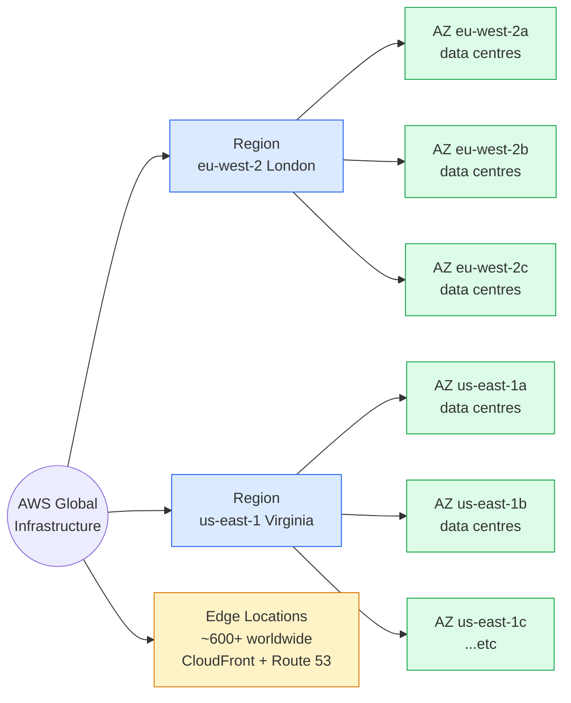

I wanted to pass the AWS Certified Cloud Practitioner exam (CLF-C02) without sitting through twenty-five hours of talking-head videos, and I wanted the first lesson to be honest about what the exam actually tests. CLF-C02's Cloud Concepts domain is 24% of the marks and it's almost entirely vocabulary — the six advantages of cloud computing, AWS's global infrastructure (regions, availability zones, edge locations), and the six pillars of the Well-Architected Framework. Get those three things welded into your head and a quarter of the exam is already paid for. Read on fellow hungovercoder.

This lesson is dataGriff's path through the CLF-C02 Cloud Concepts domain. The canonical sources are the [AWS Well-Architected Framework documentation](https://docs.aws.amazon.com/wellarchitected/latest/framework/welcome.html) and the [AWS Global Infrastructure overview](https://aws.amazon.com/about-aws/global-infrastructure/) — use this lesson alongside, not instead of, those.

This lesson is concept-heavy on purpose. We'll do real things in the next lesson — accounts, CLIs, the lot. For now, beer in one hand, this in the other.

## Pre-Requisites

- An AWS account ready to use in lesson 03 (don't create it yet — there's a clean way to do it that we'll cover when we get there)
- The willingness to learn the six pillars by name. AWS will absolutely test you on whether you can name them.
- Roughly forty-five minutes and one drink of your choice

## Why We're Brewing in the Cloud, Not the Garage

AWS markets its value with six advantages. They're stamped across the docs, the certification, and probably the carpet at re:Invent. You need all six in your head because the exam phrases questions as "which AWS Cloud value proposition BEST describes…" — and the right answer is always one of these six exact phrases.

1. **Trade capital expense for variable expense.** Stop buying servers up front. Pay for what you use.
2. **Benefit from massive economies of scale.** AWS buys hardware by the container ship; you don't.
3. **Stop guessing capacity.** Scale up on Friday night, scale down on Monday morning.
4. **Increase speed and agility.** A new environment in minutes instead of a procurement cycle.
5. **Stop spending money running and maintaining data centres.** Let someone else change the disks at 3am.
6. **Go global in minutes.** Deploy into Tokyo and São Paulo without flying anywhere.

The Tiny Rebel analogy that helps me hold this in my head: imagine you're brewing for a one-off festival. You could buy a copper kettle, lease a unit, install the plumbing, and hire a brewer — that's CapEx, and you eat the cost whether the festival sells out or not. Or you could rent kit by the hour from a shared brewhouse, pay only for the batches you make, and walk away when the festival ends. The cloud is the shared brewhouse. The savings argument isn't that the kit is cheaper — it's that you stop owning capacity you don't use.

## Where AWS Brews, Stores, and Pours It

AWS's global infrastructure has three load-bearing words you need to recognise — **Region**, **Availability Zone**, and **Edge Location** — plus **Local Zone** as a specialised fourth. A couple of others (Wavelength Zones, Outposts) show up in awareness-level questions but are rarely the right answer. Think of it as the brewery (Region — where the workload runs), the AZ cellars inside it (Availability Zones — where it's stored reliably across separate buildings), and the edge pubs out in the world (Edge Locations — where it's delivered close to the drinker).

- A **Region** is a separate geographic area — London (`eu-west-2`), Ireland (`eu-west-1`), Frankfurt (`eu-central-1`), and so on. There are 39 of them at the time of writing. Regions are isolated by design — a fire in Dublin doesn't take London down.
- An **Availability Zone (AZ)** is one or more discrete data centres inside a Region, with independent power, cooling, and networking. Each Region has a minimum of three AZs. When you "deploy across multiple AZs", you're spreading your workload across physically separated data centres a few miles apart but within the same Region.
- An **Edge Location** (sometimes called a Point of Presence) is a much smaller AWS site — hundreds of them worldwide — used by CloudFront for caching and by Route 53 for DNS. They're how AWS delivers content close to users without spinning up infrastructure in every city.
- A **Local Zone** is an extension of a Region into a metro area where AWS doesn't have a full Region — handy when you need sub-10ms latency to a specific city.

I'll be honest: the first time I read this list I confused Edge Locations with AZs for about a week. The shortcut that stuck for me — **Regions and AZs are where your stuff runs; Edge Locations are where your stuff is delivered from**. If a question is about deploying a database or running EC2, the answer is AZ or Region. If it's about delivering a website fast to users in another country, the answer is Edge Location.

## The Six Pillars Holding the Bar Up

The Well-Architected Framework is AWS's opinion on how to build well in the cloud. There are six pillars, and yes, the exam will absolutely ask you to identify which pillar a given concern belongs to.

| Pillar | One-line definition | Mnemonic |
|---|---|---|
| **Operational Excellence** | Running and monitoring systems, and continuously improving the processes that run them. | "How we keep the bar open every night." |
| **Security** | Protecting information, systems, and assets while delivering business value. | "Who's allowed behind the bar." |
| **Reliability** | The workload performs its intended function correctly and recovers from failure. | "The lights stay on even when something blows." |
| **Performance Efficiency** | Using computing resources efficiently to meet requirements. | "Not pouring a pint with a teaspoon." |
| **Cost Optimization** | Avoiding unnecessary costs and getting the best deal for what you do spend. | "Not paying for kegs you didn't drink." |
| **Sustainability** | Minimising the environmental impact of running cloud workloads. | "Closing the fridge door." |

Sustainability was added in late 2021 and CLF-C02 examiners love it as a distractor — there are exam questions that look like a Reliability or Cost question and the right answer is Sustainability because it mentions "minimising environmental impact". Read the question.

## Have a Go

Concept lessons need concept exercises. Spend ten minutes on these — they'll lock the vocabulary in tighter than reading ever does.

1. **Name the six pillars from memory.** Write them on a Post-it. If you can't get all six in thirty seconds, stick the Post-it on your monitor until you can.
2. **Pick a workload you've worked on** (or your own laptop) and label each pillar with one risk that workload has. *("Operational Excellence: nobody monitors disk usage. Cost Optimization: we forgot to delete that backup volume.")*
3. **Open the AWS Regions page** (<https://aws.amazon.com/about-aws/global-infrastructure/regions_az/>) and find your nearest Region. Note its code (`eu-west-2` for London). You'll use it on every lesson from here on.
4. **Sketch the difference between an AZ and an Edge Location** on the back of a beer mat. If you can explain it to a friend who isn't a developer, you'll remember it on exam day.

## Would I Sit CLF-C02 Tomorrow?

Not on this lesson alone — there are twelve more to go. But I'll give you my honest take on the Cloud Concepts domain: it's the easiest 24% on the exam if you actually learn the vocabulary, and the easiest 24% to drop if you don't. The pillars and the six advantages aren't intellectually hard; they just need to be **memorised verbatim**. AWS will lift exact phrases out of the framework and use them as the right answer. If you've read them once and moved on, you'll mis-pick the "operationally close" distractor and lose marks you didn't have to lose. So: drill the lists. The exam is a vocabulary test before it's a comprehension test.

If I were doing this lesson again I'd put the Well-Architected pillars first and the cloud advantages second — the pillars are higher-yield and people start strong then fade. Lead with the heavy stuff. That said, the cloud advantages set up the "why bother with any of this" framing, so they earn their place at the top.

## Sample exam questions

### Q1. A company is moving from on-premises data centres to AWS and wants to stop paying for hardware capacity it does not use. Which AWS Cloud value proposition BEST describes this benefit?

- A. Increased speed and agility
- B. Trade capital expense for variable expense
- C. Go global in minutes
- D. Stop spending money running and maintaining data centres

Answer

**B.** AWS phrases the CapEx → OpEx shift as "trade capital expense for variable expense" — and that exact wording is what the exam expects. Option D is tempting but specifically describes not running data centres, not the consumption-based pricing model.

### Q2. A solutions architect needs a workload to remain available if a single data centre fails. What is the MOST appropriate way to design the deployment?

- A. Deploy the workload across multiple AWS Regions
- B. Deploy the workload across multiple Availability Zones within a single AWS Region
- C. Deploy the workload to a single Availability Zone with auto-scaling enabled
- D. Deploy the workload to an AWS Local Zone

Answer

**B.** Multi-AZ is the default answer to "single data centre failure" — AZs are physically separate within a Region. Multi-Region (A) protects against a whole-Region failure and is overkill for this requirement; the exam wants the cheapest/simplest answer that meets the requirement.

### Q3. Which pillar of the AWS Well-Architected Framework focuses on the ability of a workload to perform its intended function correctly and consistently?

- A. Operational Excellence
- B. Reliability
- C. Performance Efficiency
- D. Security

Answer

**B.** Reliability is specifically about correctness and recovery from failure. Operational Excellence is about *how* you run and monitor systems — close, and a common distractor — but the exact phrase "perform its intended function" maps to Reliability.

### Q4. A company wants to reduce the environmental impact of its cloud workloads. Which Well-Architected pillar provides guidance for this goal?

- A. Cost Optimization
- B. Operational Excellence
- C. Sustainability
- D. Performance Efficiency

Answer

**C.** Sustainability is the sixth pillar (added in 2021) and is the only correct answer for any question mentioning environmental impact or carbon. Cost Optimization is the obvious distractor because cheaper often means less compute — but the exam tests the pillar's *named* purpose, not its side effects.

### Q5. A company wants to deliver static website assets to users worldwide with the lowest possible latency. Which AWS global infrastructure component is MOST appropriate?

- A. AWS Regions
- B. Availability Zones
- C. Edge Locations
- D. AWS Local Zones

Answer

**C.** Edge Locations (used by CloudFront) cache content close to users, which is the textbook answer to "low-latency content delivery worldwide". Local Zones (D) are for low-latency to a *specific metro area*, not worldwide — easy confusion point.

## Sources and further reading

- [AWS Well-Architected Framework documentation](https://docs.aws.amazon.com/wellarchitected/latest/framework/welcome.html) — the canonical six-pillars reference
- [AWS Global Infrastructure](https://aws.amazon.com/about-aws/global-infrastructure/) — current Region / AZ / Edge Location list, always up to date
- [Cloud computing with AWS](https://aws.amazon.com/what-is-aws/) — AWS's own framing of the six advantages of cloud
- [AWS Sustainability Pillar whitepaper](https://docs.aws.amazon.com/wellarchitected/latest/sustainability-pillar/sustainability-pillar.html) — the deeper read on the sixth pillar (added 2021)
- `SOURCES.md` at the repo root for the series-wide reference list

---

Well done on your first AWS lesson, fellow hungovercoder. You've already collected the easiest marks on the exam — assuming the six pillars and the six advantages are now in your head and not just on the page. On to lesson 03, where we stop reading and start actually setting up an account properly. Bring the beer.
