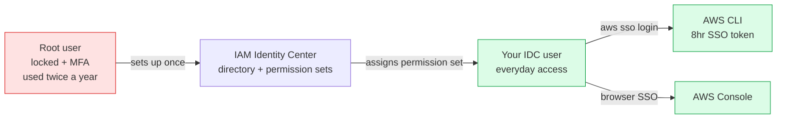

I wanted an AWS account I could actually use without breaking it, without spending a bricklayer's daily wage by accident, and without logging in as root every time I touched it. This lesson is the version of the AWS account setup story I wish I'd had on day one — the root user locked away after the first login, IAM Identity Center for the actual human-shaped access, and the CLI configured the way the AWS docs *should* tell you to (but don't, quite). Hands-on from here. Bring the keyboard.

This lesson is dataGriff's walked path through account setup and CLI configuration. The canonical sources are the [IAM Identity Center user guide](https://docs.aws.amazon.com/singlesignon/latest/userguide/what-is.html), the [AWS CLI v2 install guide](https://docs.aws.amazon.com/cli/latest/userguide/getting-started-install.html), and [AWS root user best practices](https://docs.aws.amazon.com/IAM/latest/UserGuide/best-practices.html#lock-away-credentials) — use this alongside, not instead of, those.

## Pre-Requisites

- An email address you control (the root account email is painful to change later, so use one that'll outlast a job)
- A phone with an authenticator app — Google Authenticator, Authy, 1Password, whatever
- A credit card (AWS requires one even for free-tier signup; they verify $1 and refund)
- A terminal you like
- Roughly thirty minutes

## Brewing Your First Account — The Root User and Why You'll Use It Twice

Open <https://aws.amazon.com> and hit **Create an AWS Account**. Choose "Personal" as the account type. Drop in card details (no charges yet). Pick **Basic Support** at the end — it's free, and you don't need anything else until you're running production. Set a strong password on the root user and keep going.

Once you land in the AWS Console, the **very next thing** you do — before exploring, before opening S3, before anything else — is enable MFA on the root user. Go to **IAM → My security credentials → Multi-factor authentication → Assign MFA device** and scan the QR code with your authenticator app. **Do not use SMS** — SIM swap attacks are a real and growing thing, and the time saved is twenty seconds.

Why? The root user has unrestricted access to everything — including closing your account, removing all your IAM users, and changing the billing email. If someone compromises an un-MFA'd root user, you don't have an AWS account any more. Once MFA's on, you'll log in as root maybe twice a year — to do things only root can do (close the account, change support tier, set up IAM Identity Center the first time).

> The only tasks the exam considers genuinely root-only are *closing the account*, *changing the support plan*, *changing the root email*, and a small handful of others. Everything day-to-day should be done as an IAM Identity Center user.

## The Bouncer at the Door — IAM Identity Center

Years ago, AWS told everyone to create an "IAM user" with a username, password, and a downloadable access key pair (`AKIA...`). That's the old way. Long-lived keys end up committed to git repos by accident, copied into Slack messages, left on laptops that get stolen. **AWS now strongly recommends IAM Identity Center for human users.** Tokens are short-lived, refreshed from a browser SSO login, and never live in a file on your disk longer than eight hours.

Still logged in as root, search for **IAM Identity Center** and click **Enable**. Pick the same Region you'll use day-to-day (we use `eu-west-2` for London across this series).

Then:

1. **Users → Add user.** Give yourself a username (`griff` or whatever), email, full name.
2. **Permission sets → Create permission set →** pick the AWS-managed `AdministratorAccess` for now. We'll create tighter ones in lesson 04 when we cover least-privilege properly.
3. **AWS accounts → Pick your account → Assign users or groups →** pick yourself, pick the AdministratorAccess permission set.
4. Confirm the invite from your email.
5. Set up MFA on the Identity Center user too (yes, you now have two MFA tokens — root and your Identity Center self; that's correct).
6. Note the **access portal URL** at the top of the Identity Center settings page — something like `https://d-1234567890.awsapps.com/start`. Bookmark it.



## Cracking Open the CLI

Install AWS CLI **v2**. Don't bother with v1 — it's deprecated, missing the SSO commands you need, and full of dead options.

**macOS** (recommended):

```bash
brew install awscli
```

**Linux**:

```bash
curl "https://awscli.amazonaws.com/awscli-exe-linux-x86_64.zip" -o awscli.zip
unzip awscli.zip
sudo ./aws/install
```

**Windows** — grab the MSI from <https://aws.amazon.com/cli/>. Or use WSL and the Linux instructions; that's what most people end up doing anyway.

Verify:

```bash
aws --version
```

You should see `aws-cli/2.x.x ...`. If you see `1.x.x`, your shell's still picking up an older binary — `which aws` and fix the PATH.

## Pouring the Profiles

Now wire the CLI to your Identity Center setup. **Do not** use `aws configure` — that's for old-school IAM access keys and will ask for an `AKIA...` you don't have and shouldn't create. Use `aws configure sso`:

```bash
aws configure sso
```

It walks you through it:

```text
SSO session name (Recommended): hungovercoders
SSO start URL [None]: https://d-1234567890.awsapps.com/start
SSO region [None]: eu-west-2
SSO registration scopes [sso:account:access]: <press enter>
```

The CLI opens your browser, you confirm the SSO login, you pick which AWS account and permission set to use, and then you give the profile a name:

```text
CLI default client Region [None]: eu-west-2
CLI default output format [None]: json
CLI profile name [AdministratorAccess-123456789012]: brewery-admin
```

`brewery-admin` is a friendly profile name — pick whatever maps to how you'll talk about this account in your head. Now `~/.aws/config` has a profile block and you can run:

```bash
aws s3 ls --profile brewery-admin
```

Or set it as your shell default:

```bash
export AWS_PROFILE=brewery-admin
```

When the eight-hour token expires (any AWS CLI command will tell you), refresh with one command:

```bash
aws sso login --profile brewery-admin
```

Browser opens, you click "Allow", browser closes, you're back in. No keys to rotate. No files to update.

## Sanity-Checking Your Pour

The one command every AWS user runs first:

```bash
aws sts get-caller-identity --profile brewery-admin
```

```text
{
    "UserId": "AROAEXAMPLE...:griff",
    "Account": "123456789012",
    "Arn": "arn:aws:sts::123456789012:assumed-role/AWSReservedSSO_AdministratorAccess_abc.../griff"
}
```

If you see your account ID and an `assumed-role` ARN that mentions `AWSReservedSSO`, you're in via Identity Center properly. If the ARN shows `iam::user/something`, you've fallen back to the old IAM-user flow — undo `aws configure` and run `aws configure sso` instead.

I'll be honest — the first time I set this up, I created an IAM user with access keys and committed them to a public repo within 48 hours. AWS's account scanners caught it before I did and emailed me at 3am to revoke them, which was both impressive and humiliating. Identity Center exists specifically so you can't make that mistake. The eight-hour token refresh is the *feature*, not the friction.

## Have a Go

1. **Create a second permission set called `ReadOnly`** using the AWS-managed `ReadOnlyAccess` policy. Assign it to yourself alongside `AdministratorAccess`.
2. **Configure a second CLI profile** for it (`aws configure sso` again, pick the read-only permission set when prompted). Call it `brewery-read`.
3. **Run `aws sts get-caller-identity`** against both. The ARNs differ — note how the permission-set name appears in the role path.
4. **Default to the read-only profile** in your shell (`export AWS_PROFILE=brewery-read`) and only switch to admin when you need to make changes. Belt and braces.

## Would I Set Up an Account Differently in Production?

Not really — this is broadly the same setup I'd use day one for a tactical project or a hobby account. For a serious organisation I'd skip the AWS-managed `AdministratorAccess` entirely from the start, set up Identity Center **groups** ("Engineers", "FinanceReadOnly", "Admins") rather than per-user assignments, and connect Identity Center to an external identity provider (Okta, Entra ID, Google Workspace) so leavers automatically lose access when HR deactivates them. But for a single person learning AWS, the flow above is the right one — set up groups when there's a second person to put in them, not before.

If I were doing this again I'd bookmark the Identity Center access portal URL *before* logging out of the root session — the first time I had to log back in as root just to find the URL, which is exactly the sort of root login the setup is meant to avoid.

## Sample exam questions

### Q1. Why is enabling Multi-Factor Authentication (MFA) on the AWS account root user considered a security best practice?

- A. It is required before any IAM users can be created
- B. It is required to access the AWS Free Tier
- C. It significantly reduces the risk of account takeover if the root password is compromised
- D. It enables AWS Budgets and cost alerts

<details>
<summary>Answer</summary>

**C.** MFA adds a second factor (code from an authenticator app or hardware key) so a leaked password alone is not enough to compromise the account. The other options describe unrelated features.
</details>

### Q2. A developer wants to configure AWS CLI access for an IAM Identity Center user without creating long-lived access keys. Which command should they run?

- A. `aws configure`
- B. `aws configure sso`
- C. `aws iam create-access-key`
- D. `aws sts assume-role`

<details>
<summary>Answer</summary>

**B.** `aws configure sso` walks the user through registering the CLI with an Identity Center SSO session. `aws configure` (A) is for the legacy IAM user access key flow and is what you should NOT use for human access.
</details>

### Q3. Which of the following tasks can ONLY be performed by the AWS account root user?

- A. Creating an S3 bucket
- B. Launching an Amazon EC2 instance
- C. Closing the AWS account
- D. Creating an IAM role

<details>
<summary>Answer</summary>

**C.** Closing the account, changing the support plan, and updating the root email are among the small handful of tasks that genuinely require root. Day-to-day AWS work (A, B, D) should always be done as an IAM Identity Center user.
</details>

### Q4. A company wants to give human users centrally managed access across multiple AWS accounts without distributing long-lived access keys. Which AWS service is the recommended approach?

- A. IAM users with access keys
- B. AWS IAM Identity Center
- C. Amazon Cognito
- D. AWS Directory Service

<details>
<summary>Answer</summary>

**B.** IAM Identity Center is AWS's recommended human-access service — short-lived SSO tokens, multi-account assignment, integration with external identity providers. Cognito (C) is for app users; Directory Service (D) is a managed Active Directory product.
</details>

### Q5. A developer's AWS CLI commands have started returning a "session expired" error after working earlier that day. What is the MOST LIKELY cause and remediation?

- A. The IAM user's password has expired and must be reset in the console
- B. The Identity Center session token has expired and can be refreshed with `aws sso login`
- C. The AWS account has been suspended for non-payment
- D. The CLI version is out of date

<details>
<summary>Answer</summary>

**B.** Identity Center SSO tokens are short-lived (default eight hours). `aws sso login --profile <name>` opens the browser, you confirm, the token refreshes — no keys to rotate.
</details>

## Sources and further reading

- [AWS IAM Identity Center user guide](https://docs.aws.amazon.com/singlesignon/latest/userguide/what-is.html) — canonical setup and conceptual reference
- [AWS CLI v2 install instructions](https://docs.aws.amazon.com/cli/latest/userguide/getting-started-install.html) — official install for macOS / Linux / Windows / Docker
- [Configuring the AWS CLI to use IAM Identity Center](https://docs.aws.amazon.com/cli/latest/userguide/cli-configure-sso.html) — the `aws configure sso` flow in AWS's own words
- [AWS root user best practices](https://docs.aws.amazon.com/IAM/latest/UserGuide/best-practices.html#lock-away-credentials) — what only root can do, and how to lock it down
- [AWS Multi-Factor Authentication overview](https://aws.amazon.com/iam/features/mfa/) — supported devices including hardware keys and authenticator apps
- See **[Lesson 15 — References and Further Reading](https://hungovercoders.com/training/aws-fundamentals/15-references-and-further-reading)** for the consolidated series-wide reference page

---

Right, your account's safe, root's locked away, and the CLI knows who you are. On to lesson 04, where we open the IAM Pandora's box properly — principals, policies, and the JSON syntax the exam loves to test. Bring the beer.
