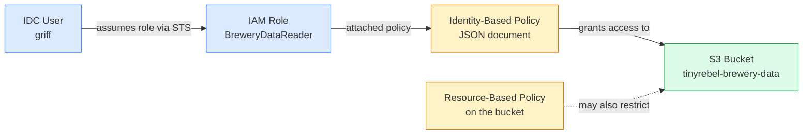

I wanted IAM to stop being the bit of AWS I was scared of. For years I thought of policies as JSON soup you reach for when something's broken — copy-paste a Stack Overflow answer until the error goes away. The truth is IAM has about six concepts, and once they click, you can read any policy on first sight and write your own without crying. CLF-C02 leans on IAM hard because the Security domain is 30% of the exam, and most of that 30% is IAM in some flavour. Read on fellow hungovercoder.

## Pre-Requisites

- Lesson 03 done — AWS account with IAM Identity Center user, AWS CLI v2 wired up
- The `brewery-admin` profile from lesson 03 (or whatever you called yours)
- A text editor for JSON

## The Six Words You Need

IAM is fundamentally six things:

1. **Principal** — *who* is making the request (a user, a role, a service, the public)
2. **Action** — *what* they want to do (e.g. `s3:GetObject`)
3. **Resource** — *what they want to do it to* (e.g. an S3 bucket ARN)
4. **Effect** — *Allow or Deny*
5. **Condition** — optional rules (e.g. only from this IP, only with MFA)
6. **Policy** — a JSON document gluing the above together

A request happens, IAM looks at all the policies that apply to the principal and the resource, and decides Allow or Deny. The whole IAM service is built on those six words. The exam tests your fluency in reading them.

## Who Walks Into the Brewery — Principals

A **principal** is anyone or anything that makes an AWS API request. Four shapes:

| Principal type | What it is | When you'd use it |
|---|---|---|
| **IAM user** | A named identity with long-lived credentials (`AKIA...` keys) | Legacy. Avoid. Use Identity Center instead. |
| **IAM Identity Center user** | A human user with short-lived SSO tokens | ✅ Default for human access |
| **IAM role** | An identity *without* long-lived credentials, that other principals "assume" | ✅ Default for everything non-human (services, cross-account, federation) |
| **IAM group** | A bundle of users you can attach policies to | Use to manage humans at scale |

The most important shift in modern AWS: **roles, not users, for everything that isn't a human at a keyboard**. EC2 instances run with a role (an "instance profile"). Lambda functions execute as a role. Cross-account access works via role assumption. A role has no password, no permanent access key — just a trust policy saying *"these principals are allowed to become me, temporarily"*.



## The Bouncer's Clipboard — Policy Anatomy

An IAM policy is a JSON document. The shape never changes. Once you've read one you've read them all.

```json
{
  "Version": "2012-10-17",
  "Statement": [
    {
      "Sid": "AllowBreweryDataRead",
      "Effect": "Allow",
      "Action": ["s3:GetObject", "s3:ListBucket"],
      "Resource": [
        "arn:aws:s3:::tinyrebel-brewery-data",
        "arn:aws:s3:::tinyrebel-brewery-data/*"
      ]
    }
  ]
}
```

Field by field:

- **`Version`** — always `"2012-10-17"`. It's a policy language version, not a date you should care about.
- **`Statement`** — a list. One policy can have many statements.
- **`Sid`** — Statement ID. Optional, human-readable label. Use it; future-you will thank you.
- **`Effect`** — `Allow` or `Deny`.
- **`Action`** — the API action(s) being permitted. Service prefix + colon + action name. `s3:GetObject`, `ec2:RunInstances`, `iam:CreateUser`. Wildcards work (`s3:*`) but try to stay narrow.
- **`Resource`** — the ARN(s) the action applies to. Bucket-level actions need the bucket ARN; object-level actions need the bucket ARN plus `/*` for everything inside.
- **`Condition`** — optional. E.g. `"Condition": {"Bool": {"aws:MultiFactorAuthPresent": "true"}}` forces MFA.

Two flavours of policy you'll meet:

- **Identity-based policy** — attached to a user, group, or role. *"This principal can do X"*. The example above is identity-based — it has no `Principal` field because the principal is whoever the policy is attached to.
- **Resource-based policy** — attached to a resource (S3 bucket, KMS key, Lambda function). *"These principals can do X to this resource"*. Has a `Principal` field naming who the rule applies to.

For most things, identity-based policies do the job. Resource-based policies show up when you need cross-account access without role assumption, or when you want the resource itself to enforce a rule no matter who attaches policies to whoever.

## Pouring the Least Strong Pint — Least Privilege

**Least privilege** means: grant exactly the permissions needed, nothing more. The exam phrases this dozens of ways and the answer is always the policy that lists specific actions on specific resources, not the one with `"Action": "*"` and `"Resource": "*"`.

Bad — what you write at 11pm to make the error go away:

```json
{
  "Effect": "Allow",
  "Action": "*",
  "Resource": "*"
}
```

Good — least privilege applied:

```json
{
  "Effect": "Allow",
  "Action": ["s3:GetObject", "s3:ListBucket"],
  "Resource": [
    "arn:aws:s3:::tinyrebel-brewery-data",
    "arn:aws:s3:::tinyrebel-brewery-data/*"
  ]
}
```

The second one says: *this principal can list the objects in the brewery data bucket and read individual objects. They cannot write. They cannot delete. They cannot touch any other bucket.*

This is the bit nobody tells you when they say "use IAM" — **the difficult bit isn't writing policies, it's keeping them narrow as the system grows**. The wildcard creep happens one feature at a time. The defence is **IAM Access Analyzer**, an AWS service that watches your real CloudTrail logs and tells you which permissions a role *actually used* — so you can write a tighter policy from real evidence rather than guessing.

## Explicit Deny Beats Everything

The IAM evaluation logic in one sentence: **default deny, plus any Allow, minus any explicit Deny — and any explicit Deny wins**.

This means you can layer a "safety net" Deny on top of broad Allows. Example: the `AdministratorAccess` managed policy gives a user everything. But your team can attach a separate policy that says `"Deny": s3:DeleteBucket on any production-* bucket`, and the user **cannot delete a production bucket no matter what other Allows they have**.

The exam tests this twice. Both times the answer is *"the explicit Deny is what wins"*.

See `example-policy.json` in this lesson folder for a complete identity-based policy that allows reads on the brewery data bucket and explicitly denies any write — runnable as-is on any S3 read role (swap the bucket name for one you own).

## Borrowing Someone Else's Wristband — Roles and Assumption

A **role** has two policies attached:

- A **trust policy** — *"who can assume this role"* (the role's `Principal`)
- One or more **permission policies** — *"what the assumed role can do"*

A user (or another role, or an AWS service) calls `sts:AssumeRole`, gets back temporary credentials, and from then on acts as the role for up to a few hours.

Three common patterns:

| Pattern | Trust policy says | Use case |
|---|---|---|
| **Service role** | "Lambda can assume me" | Lambda function execution role — Lambda picks up the role at invocation |
| **Cross-account role** | "Account 123456789012 can assume me" | A user in account A reading data in account B |
| **Federated role** | "Tokens from Identity Center / Okta can assume me" | What you've been doing in lessons 02–03 already |

The thing CLF-C02 wants you to know: **roles do not have passwords or long-lived access keys. They are assumed.** Any question that mentions "long-lived credentials for an EC2 instance" or "access keys stored on a Lambda function" is wrong; the answer is *attach a role*.

## A Quick Note on Permission Boundaries

A **permission boundary** is a separate policy that *caps* what a user or role can do — even if their attached policies say more. Use case: let developers create their own IAM users and roles, but cap those creations so they can never grant themselves admin. The exam asks about permission boundaries lightly at the Foundational level; know that they exist and that they're a *ceiling*, not a *grant*. They don't give permissions, they limit them.

## Have a Go

1. **Read your AdministratorAccess permission set policy in the console** (IAM Identity Center → Permission sets → AdministratorAccess → Inline policy). It's two lines. Notice how `"Action": "*"` and `"Resource": "*"` make it the simplest, most dangerous policy possible.
2. **Create a customer-managed policy** called `BreweryDataReadOnly` using the JSON from `example-policy.json` in this folder. Attach it to a test role.
3. **Use the IAM Policy Simulator** (search "IAM Policy Simulator" in the console) to test: with `BreweryDataReadOnly`, can the role do `s3:GetObject` on `arn:aws:s3:::tinyrebel-brewery-data/orders.csv`? (Yes.) Can it do `s3:PutObject`? (No — denied by the explicit Deny.)
4. **Write your own least-privilege policy** for a Lambda that needs to read from a DynamoDB table called `dog-treats-inventory`. Actions: `dynamodb:GetItem`, `dynamodb:Query`. Resource: the table ARN. No wildcards in the resource. Compare with what the AWS-managed `AmazonDynamoDBReadOnlyAccess` policy gives — yours should be much narrower.

## Would I Use IAM Like This in Production?

I would, and the production version is even tighter. In a real organisation I'd write almost no policies by hand — I'd use **customer-managed policies under Terraform**, version them in git, run them through a linter (`iam-policy-json-to-terraform` or `policy_sentry`), and let IAM Access Analyzer's *unused permissions* feature catch wildcard creep within 90 days of any new permission going unused. The principle is the same as what's in this lesson; the production version just adds automation and review.

Where IAM falls down is the cold-start problem — *you* don't know what permissions a new service needs, and AWS's docs are inconsistent about it. I cope by attaching broad `*Access` managed policies on day one, watching CloudTrail for two weeks to see what's actually called, then writing a narrow policy from the real usage. It's slow but it's honest.

If I were doing the very first IAM setup again, I'd skip ever attaching `AdministratorAccess` to a permission set and start with a custom permission set that has explicit `Deny` on `iam:Create*`, `iam:Attach*`, `iam:Put*` for users other than yourself — a tiny safety net against your own future mistakes.

## Sample exam questions

### Q1. An IAM policy attached to a user grants `s3:*` on all resources. A separate IAM policy attached to the same user has an explicit `Deny` for `s3:DeleteBucket`. What happens when the user tries to delete an S3 bucket?

- A. The action is allowed because the broader Allow takes precedence
- B. The action is denied because explicit Deny always wins over Allow
- C. The action is allowed because the policies cancel out
- D. The user receives a warning but the action proceeds

<details>
<summary>Answer</summary>

**B.** IAM evaluation is *default deny → any Allow → any explicit Deny wins*. An explicit Deny anywhere in the applicable policies overrides any Allow. This is the design intent for safety-net policies.
</details>

### Q2. A developer needs an EC2 instance to write objects to an S3 bucket. Which approach follows AWS best practice?

- A. Store IAM access keys in environment variables on the EC2 instance
- B. Hard-code IAM access keys in the application source code
- C. Attach an IAM role to the EC2 instance with permission to write to the bucket
- D. Share the root account's access keys with the application

<details>
<summary>Answer</summary>

**C.** EC2 instances use *instance profiles* (an attached IAM role) so they get temporary, automatically rotating credentials without anyone managing long-lived keys. Options A, B, and D are all the kind of "long-lived credentials in compute" anti-pattern the exam exists to drill out of you.
</details>

### Q3. Which of the following best describes the principle of least privilege?

- A. Grant the broadest permissions possible to reduce future support tickets
- B. Grant only the permissions required to perform a specific task, and no more
- C. Grant all permissions to administrators and no permissions to anyone else
- D. Grant permissions based on the user's job title rather than the task

<details>
<summary>Answer</summary>

**B.** Least privilege is the practice of granting exactly the permissions a principal needs to complete the task — no wildcards, no broader scopes "just in case". It's the most common security best practice phrased on the exam.
</details>

### Q4. Which AWS service helps customers identify unused permissions on IAM roles and recommend tighter policies based on actual CloudTrail usage?

- A. AWS CloudWatch
- B. AWS Config
- C. IAM Access Analyzer
- D. AWS Trusted Advisor

<details>
<summary>Answer</summary>

**C.** IAM Access Analyzer reviews IAM roles and surfaces *unused* permissions and access patterns by analysing CloudTrail data. Trusted Advisor (D) gives broader recommendations but is not the IAM-specific tool for this.
</details>

### Q5. A company has assigned a user the AWS-managed `AdministratorAccess` policy. The company also attaches a permission boundary to the same user that allows only `s3:*` and `dynamodb:*`. What can the user do?

- A. Anything, because AdministratorAccess overrides the boundary
- B. Only `s3:*` and `dynamodb:*`, because the permission boundary caps the effective permissions
- C. Nothing, because the two policies conflict
- D. Only the actions specifically named in both policies

<details>
<summary>Answer</summary>

**B.** A permission boundary is a *ceiling* on effective permissions. The user's identity policies grant a lot; the boundary restricts the effective set to the intersection — here, just S3 and DynamoDB. Boundaries do not grant permissions; they limit them.
</details>

---

Well done on your IAM lesson, fellow hungovercoder. You now read policy JSON the way a builder reads house plans — quickly, sceptically, with a finger on the bit that's about to fall down. On to lesson 05 — the shared responsibility model and AWS's security service catalogue. Bring the beer.
