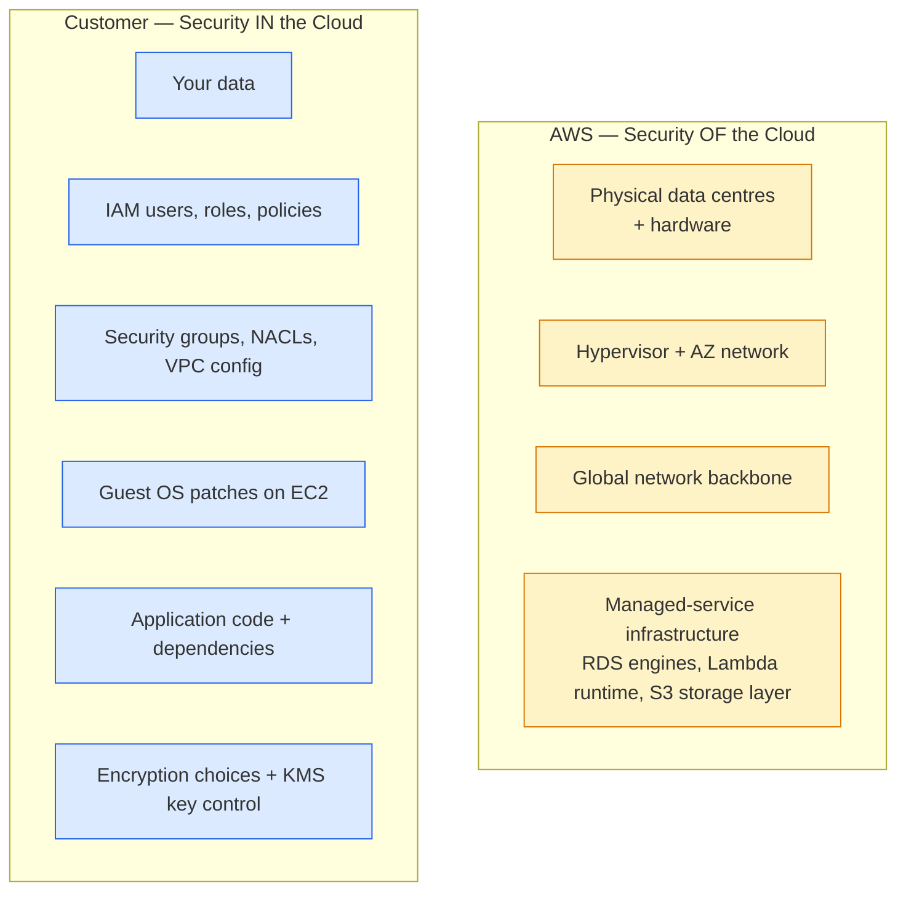

I wanted to stop being confused about which security thing is AWS's job and which is mine, and I wanted a way to remember the dozen-odd security services on the CLF-C02 syllabus without making a flashcard for each. This lesson does both — the shared responsibility model drawn properly (it isn't a fixed line, it moves with the service), then a tour of the security service catalogue grouped by *what they actually do* rather than alphabetical order. The Security & Compliance domain is 30% of the exam. Half of that 30% is naming services. Read on fellow hungovercoder.

This lesson is dataGriff's path through the shared responsibility model and the AWS security catalogue. The canonical sources are the [AWS Shared Responsibility Model page](https://aws.amazon.com/compliance/shared-responsibility-model/) and the [AWS Cloud Security overview](https://aws.amazon.com/security/) — use this alongside, not instead of, those.

## Pre-Requisites

- Lessons 03 and 04 done — account, CLI, and the IAM mental model
- A willingness to memorise a dozen one-liners. This is the most vocabulary-dense lesson in the series.

## The Line Down the Middle of the Bar

The shared responsibility model is AWS's way of saying *"some bits of security are ours, some are yours, and the line depends on the service"*. The high-level rule everyone needs to know on exam day:

| Security **OF** the cloud (AWS's job) | Security **IN** the cloud (your job) |
|---|---|
| The physical data centres | Your data |
| The hardware and hypervisor | Your IAM users and roles |
| The global network backbone | Your network configuration (security groups, NACLs) |
| The managed services' underlying infrastructure | Your operating system patches (on EC2) |
| Compliance certifications of the platform itself | Your application code |
| Hypervisor isolation between tenants | Encryption decisions for your data |

## It Depends Who's Pouring — How the Line Moves

The split shifts depending on whether you're using:

- **IaaS** (e.g. EC2) — AWS handles the hardware and hypervisor; **you** handle the OS patches, the runtime, the firewall rules on the instance. Most responsibility on you.
- **PaaS / managed services** (e.g. RDS, ElastiCache, EKS) — AWS handles the database engine version, the underlying OS, the patching. You handle the IAM, the network config, the data inside. Less responsibility on you.
- **SaaS-style fully-managed** (e.g. S3, DynamoDB, Lambda) — AWS handles everything except the data, the IAM, and the access policies. Least responsibility on you.

The exam phrases this as *"in which model is the customer responsible for patching the underlying operating system"* — and the answer is always EC2 (or a question about EC2 disguised by phrasing).

> The customer is **always** responsible for: their data, who can access it (IAM), and what they configure on the resources they create. AWS is **always** responsible for: the physical infrastructure under everything. The middle is what shifts.

## Encryption — Keeping the Recipe Safe

Two distinct things, both your responsibility, both expected on the exam.

**In-transit encryption** — TLS between client and AWS endpoint. Almost always on by default for AWS APIs and S3 endpoints; you turn it on for things like ALB-to-target traffic. Question stems mention "data being intercepted on the network".

**At-rest encryption** — encryption applied to stored data so a stolen disk yields nothing. Two flavours:

| Where the key lives | Service | When to pick it |
|---|---|---|
| AWS manages the key entirely | **SSE-S3** (S3 default), **AWS owned KMS keys** | Cheapest, simplest. Default on S3 buckets. ✅ |
| You own the key in AWS | **AWS KMS customer-managed keys** | You want audit logs of every key use and the ability to revoke it. ✅ Most common in production. |
| You bring your own key from outside | **External / HSM-backed keys** | Regulatory requirements. ⚠️ Expensive, complex. |

The service is **AWS Key Management Service (KMS)**. KMS is the answer to every exam question that mentions "managing encryption keys" or "centralised key control". Remember it with: *Keys live in KMS. Secrets live in Secrets Manager.* Different services, often confused.

## The Security Service Cellar

Group them by what they actually *do* and they're much easier to remember than the alphabetical list AWS publishes. The exam reliably tests these specific services.

### Threat detection and investigation

| Service | One-line job | Mnemonic |
|---|---|---|
| **GuardDuty** | Threat detection by analysing CloudTrail, VPC Flow Logs, DNS logs for suspicious activity | "Guard duty = the bouncer watching for trouble" |
| **Inspector** | Vulnerability scanning for EC2 instances, Lambda functions, and ECR container images | "Inspector = the health inspector checking your kitchen" |
| **Detective** | Investigation tool — pull a timeline of what an attacker did across CloudTrail/VPC logs | "Detective = comes in after the crime" |

### Data classification and confidentiality

| Service | One-line job |
|---|---|
| **Macie** | Discovers PII and sensitive data in S3 buckets (credit card numbers, names, addresses) |
| **KMS** | Manages encryption keys — the master keys behind at-rest encryption |
| **Secrets Manager** | Stores credentials (DB passwords, API keys) with automatic rotation |
| **AWS Certificate Manager (ACM)** | Provisions and renews TLS certificates for free |

### Edge and network protection

| Service | One-line job |
|---|---|
| **WAF** | Web Application Firewall — filters HTTP requests by rule (SQL injection, XSS, geo, rate limits) at CloudFront, ALB, API Gateway |
| **Shield Standard** | DDoS protection — automatic, free, on by default for every AWS account |
| **Shield Advanced** | Premium DDoS — 24/7 response team and cost protection — $3,000/month |
| **Network Firewall** | Stateful L3/L4 firewall at the VPC level |

### Compliance and audit

| Service | One-line job |
|---|---|
| **AWS Artifact** | Portal to download AWS's own compliance reports (SOC 2, ISO 27001, PCI DSS attestations) |
| **AWS Config** | Records the configuration of your AWS resources over time and evaluates compliance against rules |
| **AWS CloudTrail** | Records every AWS API call — *who called what, when, from where*. Crosses categories but lives here for audit. |
| **AWS Security Hub** | Aggregator — pulls findings from GuardDuty, Inspector, Macie, Config into a single dashboard |
| **AWS Trusted Advisor** | Best-practice checks across security, cost, performance, fault tolerance, service limits |

I'll be honest — the first time I tried to remember this list I made a flashcard for each service and got nowhere. What worked was **grouping by job, then writing one mnemonic per group**. "Threat detection" cluster = GuardDuty / Inspector / Detective. "Confidentiality" cluster = Macie / KMS / Secrets Manager / ACM. The exam questions phrase the *job*; you reverse-lookup the *service*. Cluster-first is faster than list-first.

The other thing nobody tells you: **Macie is S3-specific**. If a question mentions PII in S3, the answer is Macie. If it mentions PII anywhere else (RDS, DynamoDB, Redshift), Macie is the **wrong** answer and the question is fishing for *"the customer is responsible for classifying their own data"*.

## A Word on CloudTrail vs CloudWatch vs Config — The Three That Get Confused

This is the most-asked question pattern on CLF-C02's Security domain. Memorise the one-liners:

| Service | What it records | When to pick it on the exam |
|---|---|---|
| **CloudTrail** | API calls — who called what AWS API, when, from which IP | Audit, forensics, "who deleted the S3 bucket?" |
| **CloudWatch** | Operational metrics + logs from your apps and AWS services | Monitoring, alarms, dashboards — *operational* health |
| **Config** | Resource configuration state and compliance over time | "Was this S3 bucket public on March 12th?" / compliance evidence |

The exam writes questions that lift one of those phrases verbatim. Match the phrase to the service.

## Have a Go

1. **Open AWS Trusted Advisor** in the console (Support → Trusted Advisor) and look at the Security column. Note how many checks it runs even on the free Basic Support tier — three of them (MFA on root, public S3 buckets, security group risks) are immediately useful.
2. **Enable GuardDuty** (it's free for 30 days). Leave it running while you do the rest of the series. By lesson 14 you'll probably have findings to look at — usually false-positive port scans, but worth seeing what real GuardDuty output looks like.
3. **Open AWS Artifact** and download the latest **SOC 3** report. That's the public-facing compliance attestation AWS publishes — useful evidence to send to a customer asking *"is AWS itself secure?"* without sending them a confidential SOC 2.
4. **List the services in this lesson from memory.** Group them by job — threat detection, confidentiality, edge protection, compliance. If you can do four groups with three or four services each, you've got the lesson.

## Would I Run All These Services in a Real Account?

Day one of a new AWS account, I turn on three things and worry about the rest later:

- **GuardDuty** — free for 30 days, then ~$3/month for a small account; the threat detection it gives you is genuinely useful.
- **AWS Config** with at least the AWS-managed rule pack for S3 public access — catches the most common "oh no" mistake.
- **Cost anomaly detection** (lesson 13) — security adjacent because runaway cost is often the first symptom of a compromised key.

Beyond that I add Inspector if I'm running EC2 in production, Macie if I have PII in S3, and Security Hub once there are more than three services running so I have one dashboard instead of three. Most accounts don't need WAF or Shield Advanced until they have a public app under attack — turning them on prematurely just costs money.

If I were doing the first-time setup again I'd enable GuardDuty *first*, before ever creating a workload. It's nearly-free, it catches genuine surprises, and the 30-day trial gives you a buffer to forget about it without paying. The cost of GuardDuty in year one is less than the time you'd waste investigating one false alarm without it.

## Sample exam questions

### Q1. Under the AWS Shared Responsibility Model, which of the following is ALWAYS the customer's responsibility regardless of the service used?

- A. Patching the underlying hypervisor
- B. Replacing failed hard drives in the data centre
- C. Configuring who can access the customer's data (IAM)
- D. Maintaining the physical security of AWS Regions

Answer

**C.** IAM and the customer's own data are *always* the customer's responsibility — the customer is the only party that knows who should have access to what. Options A, B, and D are all AWS responsibilities (security *of* the cloud).

### Q2. A company stores customer records in an Amazon S3 bucket and wants to automatically discover any personally identifiable information (PII) the bucket contains. Which AWS service is MOST appropriate?

- A. Amazon GuardDuty
- B. Amazon Macie
- C. AWS Inspector
- D. AWS Trusted Advisor

Answer

**B.** Macie is the S3-specific PII discovery service. GuardDuty is for threat detection on accounts and workloads; Inspector scans EC2/Lambda/ECR for vulnerabilities; Trusted Advisor gives general best-practice checks but not PII discovery.

### Q3. Which AWS service records every API call made in an AWS account, including who called it, when, and from where?

- A. AWS Config
- B. Amazon CloudWatch
- C. AWS CloudTrail
- D. AWS Security Hub

Answer

**C.** CloudTrail = API call audit log. The classic distractor is Config (B is actually CloudWatch but the most-confused distractor is Config), which records *resource state over time* rather than the API calls themselves.

### Q4. A web application is being targeted by a Layer 7 DDoS attack consisting of high volumes of HTTP requests. Which AWS service provides the BEST mitigation against this type of attack?

- A. AWS Shield Standard alone
- B. Amazon GuardDuty
- C. AWS WAF
- D. Amazon Inspector

Answer

**C.** WAF (Web Application Firewall) filters at L7 by rule — rate-based rules and managed rule groups stop application-layer floods. Shield Standard (A) handles L3/L4 volumetric DDoS only; for L7 application attacks WAF is the answer. (Shield *Advanced* adds 24/7 response and the option to invoke the AWS DDoS Response Team, but WAF is still the L7 filter.)

### Q5. Where can an AWS customer download SOC 2, ISO 27001, and PCI DSS attestation reports for the AWS platform?

- A. AWS Trusted Advisor
- B. AWS Artifact
- C. AWS Security Hub
- D. AWS Config

Answer

**B.** AWS Artifact is the portal for AWS's compliance reports. The other three are operational/security tools; Artifact's whole purpose is downloadable third-party attestations.

## Sources and further reading

- [AWS Shared Responsibility Model](https://aws.amazon.com/compliance/shared-responsibility-model/) — canonical customer-vs-AWS split with worked examples by service type
- [AWS Security, Identity, and Compliance services landing page](https://aws.amazon.com/products/security/) — the full catalogue grouped by AWS
- [Amazon GuardDuty docs](https://docs.aws.amazon.com/guardduty/latest/ug/what-is-guardduty.html), [Amazon Macie docs](https://docs.aws.amazon.com/macie/latest/user/what-is-macie.html), [Amazon Inspector docs](https://docs.aws.amazon.com/inspector/latest/user/what-is-inspector.html) — the three threat/data services most-tested on CLF-C02
- [AWS Key Management Service Best Practices whitepaper](https://docs.aws.amazon.com/whitepapers/latest/kms-best-practices/welcome.html) — the most-cited reference for at-rest encryption decisions
- [AWS Artifact](https://aws.amazon.com/artifact/) — the portal for SOC, ISO, PCI compliance reports
- [AWS Trust Center](https://aws.amazon.com/security/) — the public top-level page customers send their own auditors to
- See **[Lesson 15 — References and Further Reading](https://hungovercoders.com/training/aws-fundamentals/15-references-and-further-reading)** for the consolidated series-wide reference page

---

Well done on your security cellar tour, fellow hungovercoder. You've now got the shared responsibility line drawn properly and most of the security catalogue grouped by job. On to lesson 06, where we start the Cloud Technology marathon properly with compute — EC2, Lambda, ECS, EKS, Fargate, Lightsail, Batch. Bring the beer.
