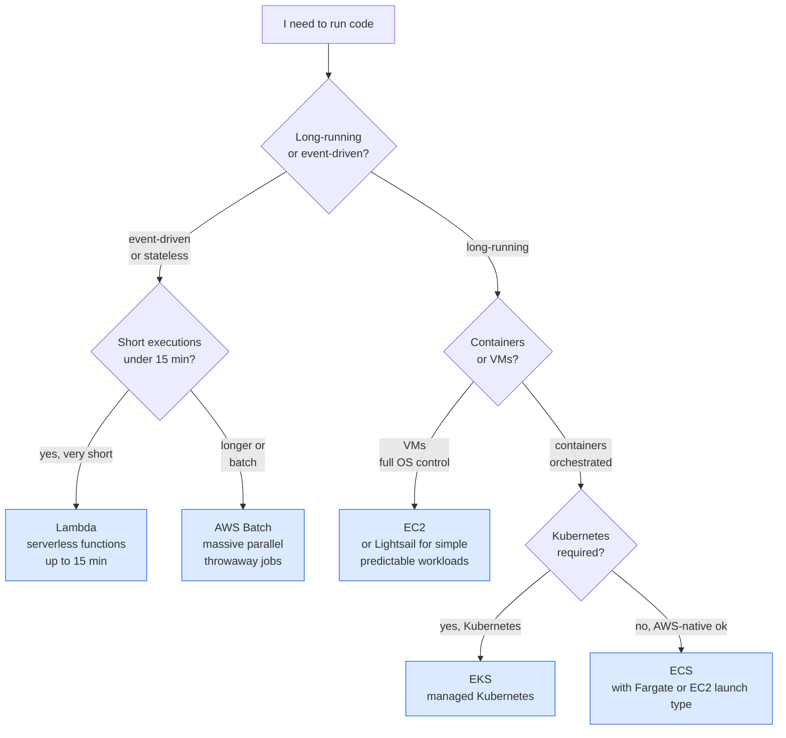

I wanted to stop reaching for EC2 every time I needed to run something. EC2 is the obvious answer for everything when you've only got one tool — but AWS has at least seven compute options and the exam tests whether you can pick the right one. Worse, EC2 has five different pricing models, and the question stem usually decides the right answer based on a single phrase like *"the workload runs for 15 minutes a day"* or *"a 3-year steady-state production server"*. This lesson nails down which is which. Read on fellow hungovercoder.

This lesson is dataGriff's path through the AWS compute catalogue. The canonical sources are the [AWS Compute landing page](https://aws.amazon.com/products/compute/) and the [EC2 instance purchasing options reference](https://docs.aws.amazon.com/AWSEC2/latest/UserGuide/instance-purchasing-options.html) — use this alongside, not instead of, those.

## Pre-Requisites

- Lessons 01–05 done
- `brewery-admin` CLI profile from lesson 03 (or whatever you called yours)
- ~30 minutes if you do the hands-on EC2 launch
- A nervous eye on the AWS cost dashboard — we'll launch a `t3.micro` that's free-tier eligible for the first year, but always tear down

## The Seven Compute Boxes



Service by service:

| Service | What it is | When to pick it |
|---|---|---|
| **EC2** | Virtual machines you SSH into | You need OS control, custom kernel modules, or vendor software that needs a real server |
| **Lambda** | Function-as-a-service, max 15 min execution | Event-driven, short tasks, infrequent or spiky usage. No servers to manage. |
| **ECS** | AWS-native container orchestrator | Container workloads where you don't need Kubernetes specifically |
| **EKS** | Managed Kubernetes | Container workloads where your team already runs Kubernetes elsewhere |
| **Fargate** | Serverless container runtime (under ECS or EKS) | When you don't want to manage the EC2 nodes that containers run on |
| **Lightsail** | Pre-packaged VPS with flat monthly pricing | Simple WordPress, dev sandboxes, "I want a VPS for £4/month" |
| **Batch** | Batch computing — schedules and runs containerised jobs | Throwaway parallel jobs: rendering, simulations, genomics, financial Monte Carlo |

**Fargate trips people up** because it's not a service you use *instead of* ECS or EKS — it's a *launch type* under one of them. ECS-on-EC2 means you manage the EC2 nodes; ECS-on-Fargate means AWS manages them and you only see containers. Same for EKS.

> **Question pattern:** anything mentioning "no servers to manage" with containers is Fargate. Anything mentioning "no servers to manage" without containers is Lambda. Anything mentioning "no servers to manage" with managed Kubernetes is EKS on Fargate.

## EC2 Pricing — The Five Models the Exam Drills

This is the chunk CLF-C02 questions love. Five pricing models, each with a one-line trigger phrase:

| Model | What you pay | Trigger phrase on the exam |
|---|---|---|
| **On-Demand** | Standard hourly/second rate, pay-as-you-go | "Short-term workload" / "unpredictable usage" / "no commitment" |
| **Reserved Instances** | 1- or 3-year commitment to a specific instance type, 40–72% discount | "Steady-state production workload" / "predictable usage for 1+ years" |
| **Savings Plans** | 1- or 3-year commitment to a $/hr spend (more flexible than RIs across instance families) | "Commitment to spend $X/hour" / "flexibility across instance families" |
| **Spot Instances** | Spare AWS capacity at up to 90% off, but AWS can terminate with 2-min warning | "Fault-tolerant" / "interruptible" / "stateless workers" / "batch processing" |
| **Dedicated Hosts** | A whole physical server reserved for you, most expensive | "Compliance requires single-tenant hardware" / "BYOL licensing tied to physical sockets" |

The exam adds **Dedicated Instances** as a distractor — same logical isolation as Dedicated Hosts but without physical socket visibility. Used for *isolation* without BYOL needs. Rare in real questions but worth recognising the phrase.

> If a question stem mentions **fault tolerance** or **interruption**, the answer is **Spot**. If it mentions **single-tenant hardware** or **BYOL with socket-bound licensing**, the answer is **Dedicated Hosts**. These two are the discriminators almost every time.

## Cracking Open a t3.micro (Hands-On)

This is the canonical "first EC2 launch" exercise. **Tear it down at the end** — even free-tier hours run out, and the attached EBS volume isn't always free.

```bash
# Launch the smallest, cheapest free-tier instance with Amazon Linux 2023
aws ec2 run-instances \
  --image-id $(aws ssm get-parameter \
      --name /aws/service/ami-amazon-linux-latest/al2023-ami-kernel-default-x86_64 \
      --query 'Parameter.Value' --output text) \
  --instance-type t3.micro \
  --count 1 \
  --tag-specifications 'ResourceType=instance,Tags=[{Key=Name,Value=brewery-test}]' \
  --profile brewery-admin
```

Note `aws ssm get-parameter` to look up the current Amazon Linux 2023 AMI — that's better than hardcoding an AMI ID that'll be deprecated in six months.

Verify it's running:

```bash
aws ec2 describe-instances \
  --filters 'Name=tag:Name,Values=brewery-test' \
  --query 'Reservations[].Instances[].[InstanceId,State.Name,InstanceType]' \
  --output table \
  --profile brewery-admin
```

Tear it down:

```bash
INSTANCE_ID=$(aws ec2 describe-instances \
  --filters 'Name=tag:Name,Values=brewery-test' \
  --query 'Reservations[].Instances[?State.Name==`running`].InstanceId | [0]' \
  --output text --profile brewery-admin)

aws ec2 terminate-instances --instance-ids $INSTANCE_ID --profile brewery-admin
```

Confirm the state moves to `terminated` (not just `stopping`), then check the **EC2 → Volumes** section in the console — the root EBS volume should be gone too, because the AMI default is "delete on termination".

I'll be honest, the first time I launched an EC2 instance via CLI I forgot to terminate it and discovered three weeks later that a `t3.small` running idle still costs about $15/month. The instance was running an `nginx` test page for nobody. That was the day I learned about `aws-nuke` and AWS Budgets, both of which we cover in lesson 13.

## Have a Go

1. **Launch the t3.micro above** and verify with `aws ec2 describe-instances`. Terminate it within the same coffee. ☕
2. **Compare Spot vs On-Demand pricing** for `t3.micro` in `eu-west-2`: open <https://aws.amazon.com/ec2/spot/pricing/> and note the current Spot price. It'll be ~70% lower than On-Demand. Now imagine that's a workload that doesn't care about interruption — that's why Spot exists.
3. **Look at AWS Pricing Calculator** (<https://calculator.aws>) and price a steady-state `t3.medium` over 3 years On-Demand vs 3-year All-Upfront Reserved. The discount should be ~60%. Now you understand why every CFO loves Reserved Instances.
4. **Draw the decision tree from memory.** Start with "I need to run code", branch on event-driven vs long-running, then on containers vs VMs, then on Kubernetes-or-not. You should end up with EC2, Lambda, ECS, EKS, Fargate (twice — under ECS and EKS), Lightsail, and Batch.

## Would I Default to a Particular Compute Service?

For new workloads in 2026, **Lambda first, Fargate second, EC2 last** is the right default ranking. Lambda has zero idle cost. Fargate has zero node management. EC2 is the most flexible but also the most expensive in undifferentiated heavy lifting — you spend engineering hours on patching, scaling, and base images that AWS already does better. The cases I reach for EC2 are: vendor software that won't run on Lambda or in a container; GPU workloads that need specific drivers; or genuine cost optimisation at scale where Reserved + ASG beats the per-execution Lambda price.

EKS is right when your organisation has already standardised on Kubernetes across multiple clouds and you don't want a second orchestrator just for AWS. If you're net-new on AWS and don't already run Kubernetes, **ECS on Fargate is the saner default** — fewer moving parts, AWS-native IAM integration, much lower learning curve. The exam doesn't make this opinion call but it's the right one in practice.

If I were doing it again I'd skip EC2 entirely for the first three months of a new project and force myself onto Lambda + Fargate. The constraints sharpen the architecture; the moment you can SSH into a box, you stop thinking carefully about what's running on it.

## Sample exam questions

### Q1. A company runs a nightly batch job that processes the day's brewery sales data. The job takes 4 hours, is fault-tolerant, and can be restarted from a checkpoint if interrupted. Which EC2 pricing model is MOST cost-effective?

- A. On-Demand Instances
- B. Reserved Instances
- C. Spot Instances
- D. Dedicated Hosts

<details>
<summary>Answer</summary>

**C.** Spot Instances offer up to 90% off On-Demand for workloads that can tolerate interruption — fault-tolerant + checkpointable batch jobs are the textbook Spot use case. Reserved (B) suits steady-state long-lived workloads, not a 4-hour nightly job.
</details>

### Q2. A development team needs to run code only in response to file uploads to an S3 bucket. Each execution takes under one minute. The team does not want to manage any servers. Which AWS service is MOST appropriate?

- A. Amazon EC2 with auto-scaling
- B. AWS Lambda
- C. Amazon ECS with EC2 launch type
- D. Amazon Lightsail

<details>
<summary>Answer</summary>

**B.** Event-driven + short execution + no servers = Lambda. EC2 (A) and ECS-on-EC2 (C) both require server management; Lightsail (D) is a VPS, not event-driven compute.
</details>

### Q3. A company wants to run Docker containers on AWS without managing any underlying EC2 instances. Which combination of services achieves this?

- A. Amazon ECS with EC2 launch type
- B. Amazon ECS or EKS with Fargate launch type
- C. Amazon EC2 with Docker installed manually
- D. AWS Batch with EC2 instances

<details>
<summary>Answer</summary>

**B.** Fargate is the serverless launch type for containers under ECS or EKS — AWS manages the underlying compute, you only define container specs. ECS-on-EC2 (A) still requires managing EC2 nodes.
</details>

### Q4. A company has a steady-state production workload that will run continuously on a specific EC2 instance type for the next three years. Which pricing model offers the LOWEST cost?

- A. On-Demand Instances
- B. Spot Instances
- C. 3-year All-Upfront Reserved Instances
- D. Dedicated Hosts

<details>
<summary>Answer</summary>

**C.** 3-year All-Upfront Reserved Instances offer the deepest discount (up to ~72%) for predictable, steady-state workloads. Spot (B) is cheaper per-hour but unsuitable for steady-state because instances can be reclaimed; Dedicated Hosts (D) are the most expensive option.
</details>

### Q5. A regulated financial services company must run a workload on hardware not shared with any other AWS customer. The company's licensing also requires visibility of the physical sockets and cores. Which EC2 option meets these requirements?

- A. On-Demand Instances
- B. Dedicated Instances
- C. Dedicated Hosts
- D. Spot Instances

<details>
<summary>Answer</summary>

**C.** Dedicated Hosts give you a whole physical server and surface socket/core information for BYOL licensing scenarios. Dedicated Instances (B) provide single-tenant hardware but without physical socket visibility, so they don't meet the licensing constraint.
</details>

## Sources and further reading

- [AWS Compute services landing page](https://aws.amazon.com/products/compute/) — every compute option AWS offers, AWS-curated
- [EC2 instance purchasing options](https://docs.aws.amazon.com/AWSEC2/latest/UserGuide/instance-purchasing-options.html) — On-Demand, Reserved, Spot, Savings Plans, Dedicated all defined officially
- [AWS Lambda function execution environment](https://docs.aws.amazon.com/lambda/latest/dg/welcome.html) — canonical Lambda reference
- [Amazon ECS vs EKS — choose your container service](https://aws.amazon.com/containers/) — AWS's own framing of the container-service choice
- [AWS Fargate overview](https://aws.amazon.com/fargate/) — the serverless launch type for ECS and EKS
- [AWS Batch user guide](https://docs.aws.amazon.com/batch/latest/userguide/what-is-batch.html) — when AWS Batch is the right answer
- `SOURCES.md` at the repo root for the series-wide reference list

---

Well done on your compute lesson, fellow hungovercoder. You've now got the seven compute boxes and the five EC2 pricing models in your head — between them they account for a chunky portion of the Cloud Technology domain on the exam. On to lesson 07 where we crack open storage: S3, EBS, EFS, FSx, Storage Gateway, and the storage classes that the exam loves to test. Bring the beer.
