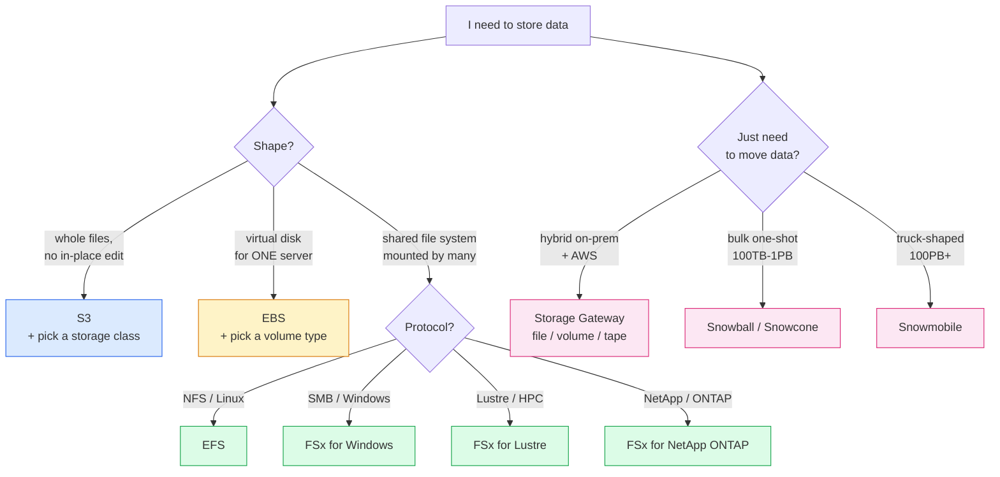

I wanted to stop calling everything "storage" and stop using S3 for things S3 isn't for. AWS has at least six distinct storage services and the exam writes its trickiest questions by hiding the type behind innocent-sounding phrasing — *"a shared file system"*, *"a single attached volume"*, *"a long-term archive accessed once a year"*. Each phrase has exactly one right answer. This lesson is the lookup table for those phrases plus the seven S3 storage classes drilled into your head. Read on fellow hungovercoder.

This lesson is dataGriff's path through the AWS storage catalogue. The canonical sources are the [AWS Storage services landing page](https://aws.amazon.com/products/storage/), the [S3 storage classes reference](https://aws.amazon.com/s3/storage-classes/), and the [EBS volume types reference](https://docs.aws.amazon.com/AWSEC2/latest/UserGuide/ebs-volume-types.html) — use this alongside, not instead of, those.

## Pre-Requisites

- Lessons 01–06 done
- `brewery-admin` CLI profile from lesson 03
- A clean head for tier names — S3 has *seven* of them

## Object, Block, File — The Three Words That Decide Everything

Almost every storage exam question is decided by which of these three shapes the workload needs:

| Shape | What it is | The service | Example use |
|---|---|---|---|
| **Object** | Whole files addressed by a key, no in-place edits | S3 | Brewery logo PNGs, brewing-log archives, data lake parquet |
| **Block** | A virtual disk attached to one server, low-latency I/O | EBS | Root volume of an EC2 instance running the brewery POS |
| **File** | A network-mounted shared filesystem, NFS or SMB | EFS / FSx | A directory of CAD drawings shared by ten EC2 workers |

The exam writes the question in the shape language; you reverse it to the service. *"Object storage"* → S3. *"Block storage"* → EBS. *"Shared file system"* → EFS (Linux/NFS) or FSx (Windows/Lustre/NetApp/OpenZFS).



## The Seven S3 Storage Classes

This is the chunk CLF-C02 questions love. Seven classes, each with a trigger phrase on the exam.

| Class | Min storage duration | Retrieval | When the exam wants it |
|---|---|---|---|
| **S3 Standard** | None | Milliseconds | "Frequently accessed data" — default ✅ |
| **S3 Intelligent-Tiering** | None | Milliseconds | "Unknown or changing access patterns" — auto-tiers ✅ |
| **S3 Standard-IA** | 30 days | Milliseconds | "Infrequently accessed but rapid retrieval when needed" |
| **S3 One Zone-IA** | 30 days | Milliseconds | "Infrequent + can be regenerated if AZ is lost" (cheaper, single-AZ) ⚠️ |
| **S3 Glacier Instant Retrieval** | 90 days | Milliseconds | "Archive but might still need fast retrieval" |
| **S3 Glacier Flexible Retrieval** | 90 days | 1 min to 12 hours | "Long-term archive, can wait for retrieval" |
| **S3 Glacier Deep Archive** | 180 days | 12 hours | "Cheapest possible, accessed once a year, retrieval can wait overnight" ❌ slow |

Three exam-question reflexes that pay off every time:

- *"Unknown or unpredictable access pattern"* → **Intelligent-Tiering**. The exam tests this *because* it's the answer most candidates don't know.
- *"Cheapest possible storage for compliance archives"* → **Glacier Deep Archive**. Always. Cost matters more than retrieval time in the stem.
- *"Single AZ acceptable because the data can be regenerated"* → **One Zone-IA**. The cost saving justification is "we can rebuild it if a region's AZ fails".

## EBS Volume Types — The Four That Matter

EBS = block storage attached to a single EC2 instance. Five volume types; four show up regularly on the exam:

| Type | Backed by | When to pick |
|---|---|---|
| **gp3** | SSD | Default general-purpose. Customisable IOPS independent of size. ✅ |
| **gp2** | SSD | Legacy general-purpose (older account default). gp3 is cheaper and better. |
| **io2 Block Express** | SSD | Highest performance — databases, transactional workloads needing sustained 100k+ IOPS |
| **st1** | HDD | Throughput-optimised — big sequential reads (log processing, data warehouses on EC2) |
| **sc1** | HDD | Cold HDD — least accessed, cheapest. Rarely a right answer on the exam. |

The CLF-C02-level shortcut: **gp3 unless the stem says high-performance database (io2) or throughput-heavy sequential (st1)**. Easy.

## EFS, FSx, and Why You'd Pick One Over the Other

Both are shared file systems. The difference is protocol and use case:

| Service | Protocol | Reach for it when |
|---|---|---|
| **EFS** | NFS (Linux) | Linux EC2 / Lambda / ECS need a shared filesystem ✅ |
| **FSx for Windows File Server** | SMB | Windows EC2 workloads, Active Directory integration |
| **FSx for Lustre** | Lustre | HPC, machine learning training, sustained 100s of GB/s |
| **FSx for NetApp ONTAP** | NFS + SMB + iSCSI | You already run NetApp on-prem and want the same tooling on AWS |
| **FSx for OpenZFS** | NFS | Snapshot-heavy workloads, ZFS feature set |

I'll be honest, FSx was the bit of AWS storage that made the least intuitive sense to me — five different file servers under one brand name, each with a different protocol heritage. The shortcut that stuck: **FSx is AWS saying "here are the other peoples' file servers, run as a service"**. Windows file server, Lustre, NetApp, OpenZFS — these are external technologies AWS wrapped. EFS is AWS's own.

## Hybrid and Bulk Transfer

If the question stem mentions on-premises connectivity or massive bulk transfer:

| Service | What it does | When the exam wants it |
|---|---|---|
| **Storage Gateway — File Gateway** | On-prem app writes to NFS/SMB share, gateway syncs to S3 | "Hybrid cloud file access backed by S3" |
| **Storage Gateway — Volume Gateway** | Presents block volumes locally, snapshots to S3 | "On-prem app needs iSCSI block storage with cloud backup" |
| **Storage Gateway — Tape Gateway** | Virtual tape library that backs to S3 + Glacier | "Replace existing on-prem tape backup with cloud" |
| **Snowball Edge** | Rugged appliance shipped to your site, transfer up to 100TB | "Bandwidth is too low to upload 80TB in a reasonable time" |
| **Snowcone** | Small portable Snow device | Same as Snowball but for edge / disconnected sites, <14TB |
| **Snowmobile** | A literal articulated lorry of storage | "Exabyte-scale migration" — rare on the exam, mostly for trivia |

The exam reflex: **anything about bandwidth being the bottleneck for bulk transfer** → Snowball. **Anything about ongoing hybrid sync** → Storage Gateway.

## Hands-On — Create a Bucket with a Lifecycle Rule

This is the "I provisioned a billable resource, I will tear it down" exercise from the AGENTS spec. Pick a globally-unique bucket name (S3 namespace is global, so add a date and your initials):

```bash
BUCKET="tinyrebel-brewing-logs-griff-20260528"

aws s3api create-bucket \
  --bucket "$BUCKET" \
  --region eu-west-2 \
  --create-bucket-configuration LocationConstraint=eu-west-2 \
  --profile brewery-admin

# Block all public access on the bucket — non-negotiable
aws s3api put-public-access-block \
  --bucket "$BUCKET" \
  --public-access-block-configuration \
    BlockPublicAcls=true,IgnorePublicAcls=true,BlockPublicPolicy=true,RestrictPublicBuckets=true \
  --profile brewery-admin

# Enable default encryption (SSE-S3)
aws s3api put-bucket-encryption \
  --bucket "$BUCKET" \
  --server-side-encryption-configuration \
    '{"Rules":[{"ApplyServerSideEncryptionByDefault":{"SSEAlgorithm":"AES256"}}]}' \
  --profile brewery-admin

# Apply the lifecycle policy from this folder
aws s3api put-bucket-lifecycle-configuration \
  --bucket "$BUCKET" \
  --lifecycle-configuration file://lifecycle-policy.json \
  --profile brewery-admin
```

`lifecycle-policy.json` in this folder takes any object under `brewing-logs/` and transitions it: Standard → Standard-IA at 30 days → Glacier Instant Retrieval at 90 days → Glacier Deep Archive at 365 days, finally deleting it at 7 years (2555 days). That's a realistic cold-data retention policy.

**Tear it down** when you're done:

```bash
./cleanup.sh "$BUCKET"
```

`cleanup.sh` in this folder empties the bucket (objects + any noncurrent versions) and removes it. AWS bills you for storage even on an "empty" bucket if there are noncurrent versions lingering from versioning, so the script handles that too.

## Have a Go

1. **Run the create + lifecycle script** above with your own bucket name. Upload a test file under `brewing-logs/test-2026-05-28.log` and check it lands in Standard initially.
2. **Open the S3 Console → Lifecycle rules** on your bucket and confirm the rule is visible. Read the human-readable preview AWS generates from the JSON — it should match the schedule above.
3. **Use AWS Pricing Calculator** to estimate the cost of storing 1TB of brewing logs at S3 Standard vs Glacier Deep Archive. The Deep Archive figure should be ~20x cheaper. That's why the lifecycle exists.
4. **Tear down the bucket** with `./cleanup.sh`. Confirm via `aws s3 ls --profile brewery-admin` that it's gone.

## Would I Use Lifecycle Rules in Production?

I would, and the production version is much more granular. Real lifecycle policies use **object tags** (not just prefixes) to make per-customer retention decisions — *"if the tag `customer-tier` is `enterprise`, keep 7 years; if `community`, keep 90 days, then delete"*. The exam tests the simpler prefix-based form because that's all CLF-C02 needs you to recognise; the production version layers tags on top.

The trap I've fallen into twice now: **set the lifecycle once, forget about it, find out two years later that 4TB of "archived" data is in Standard because somebody uploaded into a different prefix**. Lifecycle rules are silent — they don't fire if the prefix doesn't match. The defence is to set up an S3 Storage Lens dashboard for the bucket and check the storage-class distribution once a quarter. (Storage Lens is a separate awareness-level service worth knowing about for the exam — it's an analytics layer over your S3 usage.)

If I were doing it again I'd skip Standard-IA entirely and go straight from Standard to Glacier Instant Retrieval at the 30-day mark — the cost difference is small and the operational story (one transition fewer) is simpler.

## Sample exam questions

### Q1. A company stores log files in S3 that are heavily accessed for the first 30 days, then almost never accessed. The company needs to keep the logs for at least 7 years for compliance. Which combination of storage classes minimises cost?

- A. S3 Standard for the full 7 years
- B. S3 Standard for the first 30 days, then transition to S3 Glacier Deep Archive
- C. S3 Standard-IA for the full 7 years
- D. S3 One Zone-IA for the full 7 years

<details>
<summary>Answer</summary>

**B.** A lifecycle policy that keeps hot data in Standard for the first 30 days then transitions to Glacier Deep Archive is the cheapest fit. The compliance-archive use case ("rarely accessed, lowest cost") always maps to Deep Archive.
</details>

### Q2. A development team is uploading a 5 TB dataset to AWS but the office internet uploads at 50 Mbps. Which AWS service is the MOST efficient way to transfer this data?

- A. AWS DataSync
- B. AWS Snowball Edge
- C. AWS Storage Gateway
- D. Multipart upload via S3 CLI

<details>
<summary>Answer</summary>

**B.** Snowball Edge — physical appliance shipped to the customer, data copied locally, shipped back to AWS — is the textbook answer when network bandwidth is the bottleneck. At 50 Mbps a 5 TB upload would take ~10 days continuously; Snowball turns it into a courier problem instead.
</details>

### Q3. A team needs a shared file system that can be mounted concurrently by hundreds of Linux EC2 instances running an ETL pipeline. Which AWS service is MOST appropriate?

- A. Amazon S3
- B. Amazon EBS
- C. Amazon EFS
- D. Amazon FSx for Windows File Server

<details>
<summary>Answer</summary>

**C.** EFS is the managed NFS service for Linux workloads — concurrent mounts across thousands of EC2 instances are exactly the use case. EBS (B) is single-attach (or a small number of simultaneous attaches via Multi-Attach); S3 (A) is object storage, not a mounted filesystem; FSx for Windows (D) is the wrong protocol for Linux.
</details>

### Q4. An application stores images uploaded by users. The images have unpredictable access patterns — some are viewed millions of times in a week, others never. The team wants to minimise cost without managing tier transitions manually. Which S3 storage class is MOST appropriate?

- A. S3 Standard
- B. S3 Standard-IA
- C. S3 Intelligent-Tiering
- D. S3 Glacier Instant Retrieval

<details>
<summary>Answer</summary>

**C.** Intelligent-Tiering automatically moves objects between access tiers based on observed access — no lifecycle rules, no manual transitions, only a small monitoring fee per object. The phrase "unpredictable access patterns" is the exam's tell for Intelligent-Tiering.
</details>

### Q5. A company runs an on-premises file server and wants to seamlessly back the contents of its file shares to Amazon S3 while keeping a local cache for low-latency access. Which AWS service is MOST appropriate?

- A. AWS Storage Gateway — File Gateway
- B. Amazon EFS
- C. AWS Snowball Edge
- D. Amazon S3 Transfer Acceleration

<details>
<summary>Answer</summary>

**A.** File Gateway presents an NFS or SMB share to on-prem applications and asynchronously syncs the data to S3 — exactly the "hybrid file access backed by S3" pattern. Snowball (C) is a one-shot bulk move, not an ongoing sync; EFS (B) is cloud-native, not on-prem hybrid.
</details>

## Sources and further reading

- [AWS Storage services landing page](https://aws.amazon.com/products/storage/) — every storage option AWS offers, AWS-curated
- [S3 storage classes](https://aws.amazon.com/s3/storage-classes/) — official storage class comparison with minimum durations and retrieval times
- [Managing your storage lifecycle](https://docs.aws.amazon.com/AmazonS3/latest/userguide/object-lifecycle-mgmt.html) — canonical lifecycle policy reference
- [EBS volume types](https://docs.aws.amazon.com/AWSEC2/latest/UserGuide/ebs-volume-types.html) — gp3, gp2, io2, st1, sc1 with use cases
- [Amazon EFS user guide](https://docs.aws.amazon.com/efs/latest/ug/whatisefs.html) and [Amazon FSx](https://aws.amazon.com/fsx/) — shared file system options
- [AWS Storage Gateway](https://docs.aws.amazon.com/storagegateway/latest/userguide/WhatIsStorageGateway.html) — the three gateway types (File, Volume, Tape)
- [AWS Snow Family](https://aws.amazon.com/snow/) — bulk transfer when bandwidth is the bottleneck
- See **[Lesson 15 — References and Further Reading](https://hungovercoders.com/training/aws-fundamentals/15-references-and-further-reading)** for the consolidated series-wide reference page

---

Well done on your storage tour, fellow hungovercoder. You can now identify any storage-shaped question on sight by the shape (object / block / file / archive / hybrid / bulk). On to lesson 08 where we pick apart databases — RDS, Aurora, DynamoDB, ElastiCache, Redshift, and the rest of the menagerie. Bring the beer.
