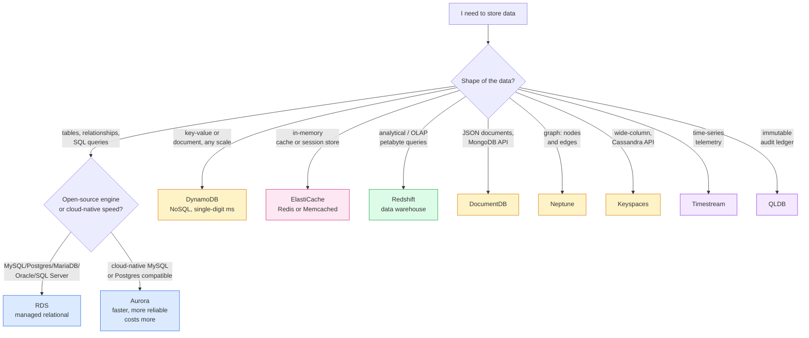

I wanted to stop using "AWS database" as a synonym for "RDS" and to be able to read a CLF-C02 question stem and instantly know which of the dozen-odd database services it's asking about. The Cloud Technology domain is 34% of the exam and databases are a big chunk of it — questions phrased as *"single-digit-millisecond latency at any scale"*, *"graph relationships between customers"*, *"petabyte-scale analytical queries"*. Each phrase has exactly one right answer. This lesson is the lookup table, themed around a Tiny Rebel brewery data platform so it sticks. Read on fellow hungovercoder.

This lesson is dataGriff's path through the AWS database catalogue. The canonical source is the [Databases on AWS landing page](https://aws.amazon.com/products/databases/), with per-engine references like the [DynamoDB Developer Guide](https://docs.aws.amazon.com/amazondynamodb/latest/developerguide/Introduction.html) and the [Amazon Aurora User Guide](https://docs.aws.amazon.com/AmazonRDS/latest/AuroraUserGuide/CHAP_AuroraOverview.html); use this lesson alongside, not instead of, those.

## Pre-Requisites

- Lessons 01–07 done
- A patience for mnemonics — this lesson covers nine database services

## The Decision Tree

## The Nine, One Line Each

| Service | What it is | Brewery analogy |
|---|---|---|
| **RDS** | Managed relational — MySQL, PostgreSQL, MariaDB, Oracle, SQL Server | The orders ledger — customers, beers, line items |
| **Aurora** | Cloud-native relational, MySQL/PostgreSQL compatible, ~5× MySQL perf | The orders ledger when the brewery scales nationally |
| **DynamoDB** | Managed NoSQL key-value, single-digit ms at any scale | The brewery's loyalty card lookups — millions per second |
| **ElastiCache** | In-memory Redis or Memcached | The "what's on tap right now" cache, refreshed every minute |
| **Redshift** | Petabyte-scale data warehouse for analytics | The CFO's monthly "where did the money go" reports |
| **DocumentDB** | MongoDB-compatible document database | The brewer's recipe book — variable schema per beer |
| **Neptune** | Graph database — nodes and edges | The "customers who drink Cwtch also drink…" recommender |
| **Keyspaces** | Managed Cassandra — wide-column NoSQL | High-write tap-room telemetry stream |
| **Timestream** | Managed time-series database | Brewery fermentation tank readings every second |
| **QLDB** | Append-only ledger with cryptographic verification | Auditable record of every keg movement, tamper-proof |

That's ten, because I had to include QLDB even though the exam tests it lightly. The first nine are the load-bearing ones.

## RDS vs Aurora — The Difference That Trips People Up

Both are relational. Both are managed. Both speak MySQL and PostgreSQL. So when does the exam want Aurora vs RDS?

| Question stem says... | Right answer |
|---|---|
| "Managed PostgreSQL" / "managed MySQL" with no special performance language | **RDS** |
| "MySQL-compatible / PostgreSQL-compatible" + "high performance" / "5× throughput" / "highest availability" | **Aurora** |
| "Oracle" / "SQL Server" / "MariaDB" | **RDS** (Aurora doesn't support these engines) |
| "Lower cost, simpler" | **RDS** |
| "Read replicas across multiple AZs with automatic failover under 30 seconds" | **Aurora** |

Aurora's killer feature for the exam: **6 copies of the data across 3 AZs by default, automatic recovery, up to 15 read replicas**. That's far more than RDS gives you out of the box. The cost: roughly 20% more than RDS for the same instance class. The exam phrases the trade-off as *"managed PostgreSQL with the highest possible availability"* — and the answer is Aurora.

> If the stem mentions **Oracle** or **SQL Server**, the answer is **always RDS**. Aurora only does MySQL- and PostgreSQL-compatible.

## DynamoDB vs ElastiCache vs Aurora — Three Speed Stories

This is the other most-confused trio. All three claim "high performance" in some sense:

- **Aurora** — relational, MySQL/PostgreSQL, "high performance" by RDS standards (5× MySQL). Best for **complex queries** at low-to-medium scale.
- **DynamoDB** — NoSQL key-value, **single-digit millisecond latency at any scale**, serverless. Best for **simple lookups** at massive scale.
- **ElastiCache** — sub-millisecond in-memory cache, Redis or Memcached. Best when you need **microseconds** and don't mind volatility.

The exam decision: if the stem mentions **"single-digit ms"** the answer is DynamoDB. If it mentions **"microsecond"** the answer is ElastiCache. If it mentions **"complex SQL queries with joins"** the answer is RDS or Aurora.

## ElastiCache Redis vs Memcached — Pick One

Both in-memory, both managed. The exam discriminator:

- **Redis** — persistence, replication, pub/sub, complex data types (sorted sets, geo). Pick this for anything beyond a flat cache.
- **Memcached** — pure cache, multi-threaded, no persistence, no replication. Pick this for simple cache-aside patterns where losing the cache is fine.

CLF-C02 reflex: if the stem mentions **persistence**, **replication**, **leaderboards**, **pub/sub**, or **session store with failover** → Redis. If it mentions **simple object cache, multi-threaded** → Memcached.

## Redshift — When the Question Is About Analytics

**Redshift is a data warehouse**, not an operational database. The exam reflex: if the stem mentions **"analytical queries"**, **"petabyte"**, **"BI reporting"**, **"OLAP"**, or **"data warehouse"** — the answer is Redshift. Never DynamoDB, never RDS, never Aurora.

Closely related but not the same:

- **Redshift Serverless** — pay-per-query Redshift, no provisioned cluster. Same engine, different billing model.
- **Athena** — SQL queries directly against S3 data (no warehouse, no loading). Lower-cost, ad-hoc analytics on data lake files.

For CLF-C02, Athena is awareness-level and Redshift is the named answer for warehousing.

## The Five Specialists — Light Touch

The exam tests these four to five lightly. Recognise them on sight:

- **DocumentDB** — MongoDB-compatible. Question mentions "MongoDB", "JSON documents", "flexible schema". ✅
- **Neptune** — graph database. Question mentions "relationships between entities", "social network", "fraud-detection graph". ✅
- **Keyspaces** — Cassandra-compatible. Question mentions "Apache Cassandra", "wide-column NoSQL". ✅
- **Timestream** — time-series. Question mentions "sensor data", "IoT telemetry", "metrics with timestamps". ✅
- **QLDB** — ledger. Question mentions "immutable", "cryptographically verifiable history", "audit trail you can't tamper with". ✅ (Note: AWS announced QLDB's planned end-of-support; it still appears on CLF-C02 because the exam blueprint includes it, but in production you'd reach for a verifiable audit log via DynamoDB streams + CloudTrail instead.)

## Honest Moment

I'll be honest — the first time I worked through this list I tried to memorise all ten flat and got nowhere. What worked was **drawing the decision tree from the data shape upwards** — *"what shape is the data?"* → relational / key-value / cache / analytical / specialist — and only then asking *"which AWS service does that shape?"*. The tree at the top of this lesson is what I'd put on a flashcard, not the alphabet list of services.

The other thing nobody mentions: **DynamoDB is the default NoSQL answer on CLF-C02**. If you see a NoSQL question and you're not sure whether it's pointing at DynamoDB / DocumentDB / Keyspaces / Neptune, the answer is almost certainly DynamoDB unless the stem specifically names MongoDB, Cassandra, or graph relationships. The other three are picked when the question *specifically* mentions their parent technology.

## Have a Go

1. **Draw the decision tree from memory.** Start with "data shape?", branch out to relational / NoSQL / cache / analytical / specialist. Should fit on one A5 page.
2. **For each of the nine main services**, write one sentence: *"I'd pick X when the stem says…"*. Use the brewery analogies if they help.
3. **Open the RDS console** and click "Create database". Look at the engine dropdown — MySQL, PostgreSQL, MariaDB, Oracle, SQL Server, Aurora. Notice Aurora appears as an *engine choice* under "Create database", not as a separate service in the navigation — that catches people out on the exam.
4. **Use AWS Pricing Calculator** to price an RDS for PostgreSQL `db.t3.medium` vs an Aurora for PostgreSQL `db.t3.medium` over a month. The Aurora figure should be ~20% higher. That cost premium is what you pay for the 6-copies-across-3-AZs storage layer.

## Would I Default to a Particular Database?

For a new workload I'd default to **DynamoDB for anything access-pattern-defined** (key lookups, simple queries, very scaled), **Aurora Serverless v2 for anything requiring relational SQL** (variable schema is fine but you'll change your mind eventually about indexes), and **ElastiCache for Redis** in front of either for read-heavy paths. That's three services that cover ~80% of operational database needs.

I'd avoid RDS for MySQL or PostgreSQL on a green-field project — Aurora's managed-storage layer is genuinely better for production and the cost premium isn't huge. RDS for Oracle and SQL Server remains the right answer when commercial licensing forces your hand.

Redshift is the obvious answer for analytics — but increasingly **S3 + Athena + Glue** is the alternative for teams not already on a warehouse. The decision is "do you have a steady-state SQL workload" (Redshift) or "do you have ad-hoc analytics on data lake files" (Athena). The exam tests both; production usually starts with Athena and migrates to Redshift when query volume justifies the cluster.

If I were doing it again I'd skip provisioned DynamoDB capacity entirely and default to **on-demand** for the first six months — the cost is usually negligible for development and small production usage, and the operational story (no capacity planning, no scaling alarms) is the right starting point.

## Sample exam questions

### Q1. A company needs a managed relational database that supports MySQL with high availability across multiple AZs, automatic recovery, and up to 15 read replicas. Which AWS service is MOST appropriate?

- A. Amazon RDS for MySQL
- B. Amazon Aurora MySQL-Compatible
- C. Amazon DynamoDB
- D. Amazon ElastiCache for Redis

Answer

**B.** Aurora MySQL-Compatible gives 6 copies of data across 3 AZs, automatic failover, and up to 15 read replicas — that's the Aurora differentiator over plain RDS for MySQL (which gives 1 standby and up to 5 read replicas). The stem's mention of "15 read replicas" is the tell.

### Q2. A web application requires single-digit millisecond response times for key-value lookups at very high request rates with virtually no upper bound on scale. Which AWS service is MOST appropriate?

- A. Amazon RDS for PostgreSQL
- B. Amazon DynamoDB
- C. Amazon Redshift
- D. Amazon ElastiCache for Memcached

Answer

**B.** Single-digit ms latency at any scale = DynamoDB, by AWS's own marketing language. ElastiCache (D) is faster but volatile and not for primary storage in the way the stem implies; Redshift (C) is for analytics; RDS (A) is for relational queries, not pure key-value lookups.

### Q3. A team wants to run complex analytical queries across 5 PB of brewery sales data accumulated over a decade. Which AWS service is MOST appropriate?

- A. Amazon Aurora PostgreSQL-Compatible
- B. Amazon DynamoDB
- C. Amazon Redshift
- D. Amazon RDS for SQL Server

Answer

**C.** Redshift is the petabyte-scale data warehouse. The stem's "5 PB" and "analytical queries" are textbook Redshift triggers. Aurora and RDS are operational databases, not warehouses; DynamoDB is NoSQL key-value.

### Q4. An application needs to track relationships between millions of customers — who follows whom, who has purchased which products with whom — and traverse those relationships efficiently. Which AWS service is MOST appropriate?

- A. Amazon Neptune
- B. Amazon DocumentDB
- C. Amazon Keyspaces
- D. Amazon DynamoDB

Answer

**A.** Neptune is the graph database — nodes and edges, traversal queries. The stem's "relationships between customers" and "traverse efficiently" point at graph; DynamoDB and the others would force the team to model relationships unnaturally in key-value or document shapes.

### Q5. A company runs an e-commerce site that needs a session store with persistence, automatic failover across AZs, and pub/sub for real-time updates. Which AWS service is MOST appropriate?

- A. Amazon ElastiCache for Memcached
- B. Amazon ElastiCache for Redis
- C. Amazon DynamoDB
- D. Amazon RDS for MySQL

Answer

**B.** ElastiCache for Redis supports persistence, replication, automatic failover, and pub/sub — none of which Memcached (A) offers. The stem's "persistence" and "pub/sub" are the Redis-vs-Memcached discriminators on the exam.

## Sources and further reading

- [Databases on AWS landing page](https://aws.amazon.com/products/databases/) — every engine grouped by data model
- [DynamoDB Developer Guide](https://docs.aws.amazon.com/amazondynamodb/latest/developerguide/Introduction.html) — canonical NoSQL key-value reference
- [Amazon Aurora User Guide](https://docs.aws.amazon.com/AmazonRDS/latest/AuroraUserGuide/CHAP_AuroraOverview.html) — 6-copy storage, 15 read replicas, MySQL/Postgres compatibility
- [Amazon RDS User Guide](https://docs.aws.amazon.com/AmazonRDS/latest/UserGuide/Welcome.html) — the managed-relational reference for all five engines
- [Amazon Redshift overview](https://docs.aws.amazon.com/redshift/latest/dg/welcome.html) — petabyte-scale data warehouse
- [Amazon ElastiCache](https://docs.aws.amazon.com/AmazonElastiCache/latest/red-ug/WhatIs.html) — Redis vs Memcached discriminators
- [DynamoDB Best Practices](https://docs.aws.amazon.com/amazondynamodb/latest/developerguide/best-practices.html) — partition keys, single-table design, capacity modes
- See **[Lesson 15 — References and Further Reading](https://hungovercoders.com/training/aws-fundamentals/15-references-and-further-reading)** for the consolidated series-wide reference page

---

Well done on your database lesson, fellow hungovercoder. You can now read a question stem and pick the right database service in seconds — that's most of what CLF-C02 wants from this section. On to lesson 09 where we crack open networking — VPCs, subnets, security groups vs NACLs, Route 53, CloudFront, Direct Connect. Bring the beer.
