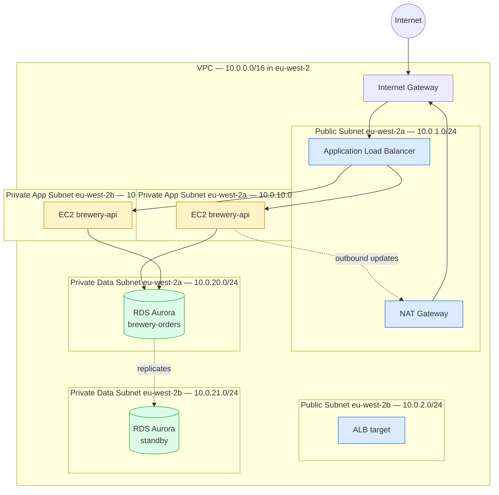

I wanted networking on AWS to stop being the bit I avoided. Every account has a Default VPC ready to go, and for a long time I treated it like Wi-Fi — *something that just works, don't poke it*. The problem with that approach is the exam tests it heavily, the production version always needs the bits I never learned, and getting bitten by *"why won't my Lambda talk to my RDS"* at 11pm on a Friday is preventable. This lesson is the VPC pieces drawn properly plus the eight or so other networking services CLF-C02 wants you to recognise. Read on fellow hungovercoder.

This lesson is dataGriff's path through AWS networking. The canonical sources are the [Amazon VPC User Guide](https://docs.aws.amazon.com/vpc/latest/userguide/what-is-amazon-vpc.html), the [Amazon Route 53 Developer Guide](https://docs.aws.amazon.com/Route53/latest/DeveloperGuide/Welcome.html), and the [AWS Networking and Content Delivery services landing page](https://aws.amazon.com/products/networking/) — use this lesson alongside, not instead of, those.

## Pre-Requisites

- Lessons 01–08 done
- A clean head for *subnet* vs *security group* vs *NACL* — these get confused

## The Tiny Rebel Three-Tier VPC

What you're looking at:

- **VPC** — a logically isolated network in a Region, with a CIDR block you choose (`10.0.0.0/16`)
- **Subnets** — chunks of the VPC CIDR pinned to one AZ each. Public if their route table points at an Internet Gateway; private otherwise.
- **Internet Gateway (IGW)** — the door for inbound + outbound internet traffic
- **NAT Gateway** — lets private subnets *initiate* outbound internet calls (e.g. `apt-get update`) without being directly reachable from the internet. **Charged per hour + per GB processed** — this is the cost item that surprises everyone.
- **Application Load Balancer (ALB)** — distributes traffic across the EC2 targets

The three tiers — public (ALB, NAT), private app (EC2), private data (RDS) — is the AWS-canonical pattern. The exam phrases it as *"web tier, application tier, database tier"*.

## Security Groups vs NACLs — The Confusion CLF-C02 Loves

Both are firewalls, but they sit at different layers and behave differently. Get this wrong and you'll mis-pick a question on every practice exam.

| | Security Group | Network ACL |
|---|---|---|
| Scope | Attached to an instance / ENI | Attached to a subnet |
| Stateful? | ✅ Yes — return traffic auto-allowed | ❌ No — must allow return traffic explicitly |
| Rules | **Allow only** (no deny) | **Allow and Deny** |
| Evaluation | All rules evaluated, any match allows | Rules numbered, first match wins |
| Default | Deny all inbound, allow all outbound | Default NACL allows all inbound and outbound |
| Use it for | The everyday "what can talk to this instance" | Coarse subnet-wide blocks (block an IP range entirely) |

> **Exam reflex:** if the stem talks about *"a single instance"* or *"the database tier"*, it's a Security Group. If it talks about *"the whole subnet"* or *"block an IP range"*, it's a NACL. Almost every question maps cleanly.

The NACL stateless point catches people: if you allow inbound TCP 443 on a NACL, you must also explicitly allow outbound on the ephemeral port range (1024–65535) for return traffic. Security Groups do this automatically because they're stateful.

## DNS, CDN, and the Edge Services

| Service | What it does | Trigger phrase |
|---|---|---|
| **Route 53** | AWS's DNS service — hosted zones, latency-based / geo / failover routing | "Domain registration" / "DNS routing" / "health check + failover" |
| **CloudFront** | Global CDN — caches at 600+ Edge Locations | "Low-latency content delivery worldwide" / "cache static assets" |
| **Global Accelerator** | TCP/UDP routing via AWS backbone for non-HTTP workloads | "Improve global performance for a non-HTTP protocol" / "static anycast IP" |
| **API Gateway** | Managed HTTP/REST/WebSocket frontend with auth, throttling, caching | "Expose Lambda as a REST API" / "manage API keys + usage plans" |

**CloudFront vs Global Accelerator** — both speed up traffic globally via AWS edge infrastructure, but CloudFront is content-aware (HTTP/HTTPS, caches responses) while Global Accelerator is protocol-agnostic at L4 (TCP/UDP, doesn't cache). The exam discriminator: if the workload is **HTTP**, use **CloudFront**. If it's anything else (gaming, VoIP, IoT) or needs a **static anycast IP**, use **Global Accelerator**.

**Route 53 routing policies** are heavily tested. Memorise these phrase mappings:

- "Route to the lowest-latency endpoint" → **Latency-based**
- "Route a percentage of traffic to one Region" → **Weighted**
- "Route based on user location" → **Geolocation** (or **Geoproximity** with bias)
- "Route to a backup if the primary is unhealthy" → **Failover**
- "Multiple healthy IP addresses round-robined" → **Multivalue answer**

## Hybrid Connectivity

| Service | What it does | When the stem wants it |
|---|---|---|
| **Site-to-Site VPN** | IPsec tunnel between on-prem and a VPC over the public internet | "Encrypted connection from on-prem to AWS, set up in hours, low cost" |
| **Direct Connect (DX)** | Dedicated fibre cross-connect via an AWS partner location | "Consistent low latency" / "high bandwidth" / "predictable costs" / "1 Gbps+" |
| **Transit Gateway (TGW)** | Hub-and-spoke for connecting many VPCs + on-prem in one place | "Connect 30+ VPCs efficiently" / "central hub" — replaces the mess of VPC peerings |
| **VPC Peering** | Direct connection between two VPCs (no transitive routing) | "Connect two VPCs" — fine for ≤ a handful; TGW above that scale |
| **PrivateLink** | Private endpoints inside your VPC for AWS services or 3rd-party SaaS | "Reach S3 without going over the internet" / "private access to a vendor SaaS" |

The trade-off the exam tests most: **VPN vs Direct Connect**. VPN is cheap and quick to set up (hours, runs over the public internet); Direct Connect is expensive and slow to set up (weeks, requires partner provisioning) but gives consistent latency and high bandwidth. The exam stem *"requires consistent low latency and high bandwidth"* always maps to Direct Connect.

> **Belt and braces in production:** Direct Connect for the primary path, Site-to-Site VPN as a backup. The exam asks about this pattern as *"high availability for hybrid connectivity"*.

## Honest Moment

I'll be honest — the first time I had a Lambda fail to connect to an RDS in a "private subnet" I spent two hours blaming security groups and then realised I hadn't put the Lambda in the VPC at all. **By default, Lambda runs outside any VPC**. To talk to an RDS in private subnets you have to attach the Lambda to those same VPC subnets, with a security group, and the Lambda's cold start gets slower because of the ENI attachment. The docs mention this once in passing; finding out at 11pm in production is the lived experience.

The other classic gotcha — and the exam doesn't quite test this but production will bite you for it — **NAT Gateways cost about $40 a month each in `eu-west-2` plus $0.045 per GB processed**. Three AZs means three NAT Gateways which is ~$120 fixed cost. For dev environments use a NAT *Instance* (a t3.nano running a NAT script) for ~$4 a month, or use VPC Endpoints / PrivateLink for the specific services you need from private subnets and skip the NAT Gateway entirely.

## Have a Go

1. **Open the VPC console** and look at the Default VPC in your account. Note: one VPC, one IGW, public subnets in every AZ, default Security Group, default NACL. That's the simplest possible setup. AWS doesn't recommend running production in it.
2. **Diagram your own three-tier VPC** for a brewery API the way the mermaid diagram above shows: pick a CIDR (`10.0.0.0/16` is fine), divide into public + private app + private data subnets across two AZs. Pin which AWS service belongs in each tier.
3. **Write the security group rules** for the brewery-api EC2 instance. Inbound from ALB only on port 443. Outbound to RDS only on port 5432. No 0.0.0.0/0 anywhere except the ALB's inbound.
4. **Look at Route 53 latency-based routing** in the console — you can create a hosted zone for any domain (or use a test one) and add two A records with the same name, one for `eu-west-2` and one for `us-east-1`. Route 53 sends each user to the closer Region automatically. This is what CloudFront does for HTTP and Route 53 does at the DNS layer.

## Would I Build the Default VPC in Production?

No, and AWS doesn't recommend it either. In production I'd use **AWS Control Tower** (lesson 12) to spin up a VPC per account from a tested Terraform module, with the three-tier subnet split, VPC Flow Logs to CloudWatch, all NACLs default-allow but Security Groups tight, and a Transit Gateway connecting the workload VPCs to a shared services VPC for DNS / Active Directory / SSO. That's a lot of moving parts for one paragraph but it's the boring reliable setup every serious AWS shop converges on.

The biggest cost optimisation I'd reach for in a new VPC is **VPC Endpoints (PrivateLink)** for S3 and DynamoDB before adding any NAT Gateways — those endpoints are free for S3/DynamoDB Gateway endpoints and let private subnets reach S3 without going through a NAT. A NAT Gateway processing 500 GB/month of S3 traffic costs ~$22; a Gateway endpoint costs $0.

If I were doing this lesson again I'd put the NAT Gateway cost callout at the top, not in the honest-moment beat. It's the single biggest "I learned this the hard way" pattern in AWS networking and it deserves its own marquee.

## Sample exam questions

### Q1. A company wants to allow EC2 instances in a private subnet to download patches from the internet without the instances being reachable from the internet. Which AWS service is MOST appropriate?

- A. Internet Gateway
- B. NAT Gateway
- C. Virtual Private Gateway
- D. Direct Connect

Answer

**B.** NAT Gateway lets private subnet instances *initiate* outbound internet traffic without being reachable inbound — the textbook "patches and package updates" use case. Internet Gateway (A) would make them publicly reachable; VGW (C) is for VPN; Direct Connect (D) is for on-prem connectivity.

### Q2. Which AWS resource is stateful, supports only Allow rules, and is attached to an EC2 instance to control its inbound and outbound traffic?

- A. Network ACL
- B. Security Group
- C. AWS WAF web ACL
- D. Route Table

Answer

**B.** Security Groups are stateful, allow-only, and attach to instances/ENIs. NACLs (A) are stateless, support deny rules, and attach to subnets — the four-property distinction is the most reliable one to memorise.

### Q3. A company needs a consistent, high-bandwidth, low-latency network connection from its on-premises data centre to AWS. The connection must avoid the public internet entirely. Which service is MOST appropriate?

- A. Amazon CloudFront
- B. AWS Site-to-Site VPN
- C. AWS Direct Connect
- D. AWS Global Accelerator

Answer

**C.** Direct Connect is the dedicated fibre cross-connect — consistent latency, high bandwidth, no public internet. VPN (B) runs over the public internet and provides encryption but not predictable performance; CloudFront and Global Accelerator are edge services, not hybrid connectivity.

### Q4. A global media company wants to deliver static images and videos to users with the lowest possible latency. Which AWS service is MOST appropriate?

- A. AWS Direct Connect
- B. Amazon Route 53
- C. Amazon CloudFront
- D. Amazon API Gateway

Answer

**C.** CloudFront caches static content at 600+ Edge Locations worldwide and serves users from the nearest one — textbook low-latency global content delivery. Route 53 (B) handles DNS, not content delivery.

### Q5. A company operates 25 VPCs across multiple AWS accounts and wants to connect them all efficiently without managing 300 pairs of VPC peerings. Which AWS service is MOST appropriate?

- A. AWS PrivateLink
- B. AWS Transit Gateway
- C. VPC Peering
- D. AWS Direct Connect

Answer

**B.** Transit Gateway is a hub-and-spoke network connector — each VPC attaches once to the TGW and can route to any other attached VPC. With 25 VPCs you'd otherwise need 300 peerings (n × (n-1) / 2); TGW reduces it to 25 attachments.

## Sources and further reading

- [Amazon VPC User Guide](https://docs.aws.amazon.com/vpc/latest/userguide/what-is-amazon-vpc.html) — canonical VPC, subnet, route table, IGW, NAT reference
- [Security Groups vs Network ACLs](https://docs.aws.amazon.com/vpc/latest/userguide/VPC_Security.html#VPC_Security_Comparison) — official side-by-side comparison
- [Amazon Route 53 routing policies](https://docs.aws.amazon.com/Route53/latest/DeveloperGuide/routing-policy.html) — latency, weighted, geolocation, failover, multivalue, geoproximity
- [Amazon CloudFront documentation](https://docs.aws.amazon.com/AmazonCloudFront/latest/DeveloperGuide/Introduction.html) — CDN with global edge caching
- [AWS Global Accelerator](https://docs.aws.amazon.com/global-accelerator/latest/dg/what-is-global-accelerator.html) — anycast IPs for non-HTTP global routing
- [AWS Direct Connect overview](https://docs.aws.amazon.com/directconnect/latest/UserGuide/Welcome.html) and [Site-to-Site VPN](https://docs.aws.amazon.com/vpn/latest/s2svpn/VPC_VPN.html) — hybrid connectivity options
- [AWS Transit Gateway](https://docs.aws.amazon.com/vpc/latest/tgw/what-is-transit-gateway.html) — hub-and-spoke multi-VPC connectivity
- `SOURCES.md` at the repo root for the series-wide reference list

---

Well done on your networking lesson, fellow hungovercoder. You've now drawn a production-shaped VPC, learned the Security Group vs NACL distinction, and recognised the edge / hybrid / inter-VPC services. On to lesson 10 where we hit application integration and observability — SNS, SQS, EventBridge, CloudWatch, CloudTrail, and Config. Bring the beer.
