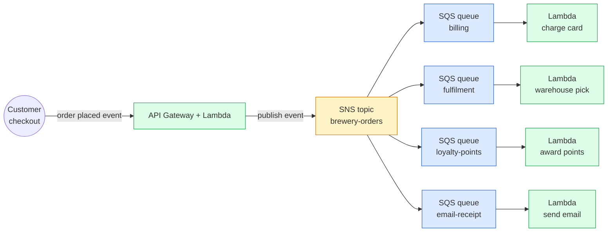

I wanted to stop building tightly-coupled systems and learn how to use AWS's messaging plumbing properly. Event-driven architectures are the modern default — they're how a brewery order gets simultaneously billed, fulfilled, emailed to the customer, and pushed to the loyalty system without any of those four systems knowing about each other. AWS gives you four ways to wire up the messaging, and CLF-C02 tests whether you can pick the right one. Then it tests whether you can tell apart CloudWatch, CloudTrail, and Config. Read on fellow hungovercoder.

This lesson is dataGriff's path through AWS application integration and observability. The canonical sources are the [AWS Application Integration services landing page](https://aws.amazon.com/products/application-integration/), [Amazon CloudWatch documentation](https://docs.aws.amazon.com/AmazonCloudWatch/latest/monitoring/WhatIsCloudWatch.html), [AWS CloudTrail user guide](https://docs.aws.amazon.com/awscloudtrail/latest/userguide/cloudtrail-user-guide.html), and [AWS Config developer guide](https://docs.aws.amazon.com/config/latest/developerguide/WhatIsConfig.html) — use this lesson alongside, not instead of, those.

## Pre-Requisites

- Lessons 01–09 done
- A clear head for the *publish-subscribe* vs *queue* mental model

## The Brewery Order Fan-Out

This is the canonical AWS event-driven pattern — **SNS topic publishes once, multiple SQS queues subscribe, each queue feeds a Lambda that handles its own slice of the work**. If billing's broken, fulfilment still ships the beer. If loyalty's offline, the email still goes out.

## SNS vs SQS vs EventBridge — Three Different Shapes

These three are the most-confused trio in the application integration domain. Get the discriminator phrases lodged in your head.

| Service | Shape | When the stem wants it |
|---|---|---|
| **SNS** | Pub/sub fan-out — one message, many subscribers | "Notify multiple systems of the same event" / "fan out to many endpoints" |
| **SQS** | Queue — one message, one consumer (whoever polls first) | "Decouple producer from consumer" / "buffer spikes" / "process in order with FIFO" |
| **EventBridge** | Event bus with filtering rules + native SaaS integrations | "Route events based on content" / "filter events by attributes" / "integrate with third-party SaaS" |

SNS and SQS are often paired together (the fan-out pattern above). EventBridge supersedes SNS for content-aware routing — if the stem mentions filtering events by *content*, the answer is EventBridge. If it just says "notify multiple endpoints", SNS is fine.

### SQS — Standard vs FIFO

SQS has two flavours:

| Type | Order | Duplication | Throughput |
|---|---|---|---|
| **Standard** | Best-effort ordering | At-least-once (duplicates possible) | Effectively unlimited |
| **FIFO** | Strict first-in-first-out | Exactly-once processing | 3000 msgs/sec with batching, 300/sec without |

> The exam reflex: if the stem mentions **"order matters"** or **"exactly once"** → **FIFO**. Otherwise → **Standard**. Standard is the default because it scales further and costs less.

### EventBridge — When SNS Is Not Enough

EventBridge is the modern event bus. Three things it does that SNS doesn't:

1. **Content-based filtering** — subscribe to events where `detail.beerStrength > 7`
2. **Schema registry** — versioned event schemas you can generate code from
3. **Native SaaS integrations** — receive events directly from Shopify, Stripe, Zendesk, GitHub, etc.

The exam phrases it as *"route events to different targets based on event attributes"* or *"receive events directly from a third-party SaaS application"* — both point at EventBridge.

## Step Functions — When the Workflow Has State

**Step Functions** is a managed state machine — coordinate multiple Lambda invocations, retries, branches, parallel execution, with a visual workflow. The exam reaches for it when the stem mentions:

- "Orchestrate multiple Lambda functions"
- "Workflow with retries and error handling"
- "Visual state machine"
- "Long-running multi-step business process"

If you'd otherwise embed step-by-step logic inside a Lambda (try this, then that, retry if failed, branch on result), use Step Functions instead. Don't write workflow plumbing in Lambda code.

## A Couple More Worth Recognising

| Service | One-line job |
|---|---|
| **Amazon MQ** | Managed ActiveMQ / RabbitMQ — pick this when **migrating** existing apps using those brokers, not for new builds |
| **AppFlow** | Managed SaaS-to-SaaS / SaaS-to-AWS data transfer (Salesforce ↔ S3, Slack ↔ S3, etc.) |
| **AppSync** | Managed GraphQL — light awareness on CLF-C02 |
| **API Gateway** | Already covered in lesson 09 — HTTP/REST/WebSocket frontend |

The Amazon MQ exam trigger is **"the company already uses ActiveMQ / RabbitMQ on-prem and wants to migrate without rewriting"**. For greenfield, SNS/SQS/EventBridge are always preferred.

## The Three That Get Confused — Take Two

I introduced this in lesson 05 because it's a Security domain question too. It's also an Observability question. Same one-liner:

| Service | What it records | When to pick on the exam |
|---|---|---|
| **CloudWatch** | Metrics, logs, alarms, dashboards from AWS services + your apps | Operational health / monitoring / alerts |
| **CloudTrail** | API calls — *who called what AWS API, when, from where* | Audit / forensics / "who deleted this?" |
| **Config** | Resource configuration state over time + compliance rules | "Was this resource compliant on date X?" / drift detection |

If the stem mentions **performance**, **utilisation**, **alarms**, or **dashboards** → **CloudWatch**. If it mentions **audit**, **who-did-what**, or **API call history** → **CloudTrail**. If it mentions **compliance**, **resource state at a point in time**, or **configuration drift** → **Config**.

## X-Ray — Lightly Tested but Worth Recognising

**X-Ray** is distributed tracing — it shows the request flow through your system across multiple services, with latency for each hop. The exam mentions it as *"identify performance bottlenecks across multiple microservices"* or *"trace a request as it crosses Lambda, ECS, and DynamoDB"*. Recognise the phrase; rarely the right answer on Foundational but it shows up.

## Honest Moment

I'll be honest — for years I built event-driven systems with SNS topics talking directly to Lambdas, no SQS in between. It worked, but every Lambda failure meant a lost event. The first time I added SQS as a buffer between SNS and the Lambda, recovery from a deploy bug went from *"replay events manually for an hour"* to *"the queue drained itself in five minutes when the Lambda came back"*. **SQS isn't optional in production — it's the retry-and-buffer layer that makes SNS fan-out survivable.** The exam doesn't quite make this point, but every architect with scars from a failed deploy will.

The CloudWatch / CloudTrail / Config trio is *the* most-confused set on the exam, and I'm not going to pretend the difference is intuitive. The shortcut that finally stuck for me: **CloudWatch is the "now" view (metrics, alarms, logs streaming in), CloudTrail is the "log of API calls" (what someone did), Config is the "snapshot history of resources" (what something looked like)**. Three different time slices on three different things.

## Have a Go

1. **Draw the brewery fan-out diagram from memory.** SNS in the middle, four SQS queues, four Lambdas. Practise saying out loud *"if billing's broken, the email still goes out"*.
2. **Set up an SNS topic and an SQS subscription** via the console. Send a test message via `aws sns publish` and watch it land in the SQS queue. Total cost: $0.
3. **In CloudWatch Logs**, find the `/aws/lambda/...` log groups for any Lambda you've created in earlier lessons. Look at how the logs are structured.
4. **Open CloudTrail** and look at recent API events. Note: every action you've taken in this series (create user, launch instance, create bucket) is in there. That's the audit log.
5. **Open AWS Config** and enable it (free for the first month). Note how it lists every resource in your account and records changes to them over time.

## Would I Use This Stack in Production?

I would, and the production version is exactly what's drawn here — SNS for fan-out, SQS for buffer + retry, Lambda for compute, EventBridge for cross-service / SaaS integration, Step Functions when the workflow has more than three steps. The pattern is so canonical that AWS now provides **EventBridge Pipes** (a single resource that connects a source to a target with optional filtering and enrichment) which collapses the SNS+SQS+Lambda pattern into one configuration object for simpler cases.

The observability stack in production is **CloudWatch for metrics and logs**, **CloudTrail logging to an S3 bucket in a separate account** for tamper resistance, **Config rules for compliance evidence**, and **X-Ray for tracing the hot paths**. Plus a third-party APM (Datadog, New Relic) for anything more sophisticated than CloudWatch can offer — the AWS-native tools cover compliance and basic ops but aren't best-in-class for performance triage.

If I were doing it again I'd skip Amazon MQ entirely — it's only there as a migration path and most teams who think they need it would be better served rewriting onto SNS/SQS during the migration anyway.

## Sample exam questions

### Q1. A company wants to decouple a customer-facing API from a backend processing system. The backend may be temporarily unavailable, and no messages should be lost during downtime. Which AWS service is MOST appropriate?

- A. Amazon SNS
- B. Amazon SQS
- C. Amazon Kinesis Data Streams
- D. AWS Step Functions

Answer

**B.** SQS is the queue that buffers messages while the consumer is unavailable — the canonical "decouple + survive downtime" pattern. SNS (A) is pub/sub fan-out without buffering; Kinesis (C) is for real-time streaming analytics; Step Functions (D) is for workflow orchestration.

### Q2. An e-commerce platform needs to notify multiple downstream systems (billing, fulfilment, email, loyalty) every time an order is placed, with each system processing the message independently. Which combination of AWS services is MOST appropriate?

- A. A single SQS queue read by all four systems
- B. An SNS topic fanning out to four SQS queues, each read by one system
- C. Step Functions orchestrating all four systems sequentially
- D. EventBridge routing all events to a single Lambda

Answer

**B.** SNS-fans-out-to-SQS is the canonical pattern for "publish once, process independently with each consumer's own retry/buffer". A single SQS queue (A) would let only one consumer process each message; sequential workflow (C) wouldn't allow parallelism; a single Lambda (D) couples the consumers.

### Q3. A team needs to record every API call made in an AWS account for security audit and forensic investigation purposes. Which AWS service is MOST appropriate?

- A. Amazon CloudWatch
- B. AWS CloudTrail
- C. AWS Config
- D. AWS X-Ray

Answer

**B.** CloudTrail is the API call audit log — who called what, when, from where. CloudWatch (A) records operational metrics and logs from apps; Config (C) records resource state over time; X-Ray (D) does distributed tracing.

### Q4. A compliance team needs to determine whether an S3 bucket was configured to allow public access at a specific point in time three months ago. Which AWS service is MOST appropriate?

- A. AWS CloudTrail
- B. Amazon CloudWatch Logs
- C. AWS Config
- D. AWS Trusted Advisor

Answer

**C.** AWS Config records resource configuration state over time and can answer "what did this resource look like on date X?". CloudTrail (A) records who *changed* the bucket and when, but Config is the right tool for *state at a point in time*.

### Q5. A team is building an order-processing workflow that involves multiple Lambda functions, conditional branches, retries with exponential backoff, and a parallel fan-out step. Which AWS service is MOST appropriate to orchestrate this?

- A. Amazon SQS
- B. AWS Step Functions
- C. Amazon EventBridge
- D. AWS Lambda Destinations

Answer

**B.** Step Functions is AWS's managed state machine — branches, retries, parallel execution, visual workflow. Writing this logic inside a single Lambda (D) would couple workflow with business logic; SQS and EventBridge are messaging, not orchestration.

## Sources and further reading

- [AWS Application Integration services landing page](https://aws.amazon.com/products/application-integration/) — the full messaging catalogue
- [Amazon SNS documentation](https://docs.aws.amazon.com/sns/latest/dg/welcome.html) and [Amazon SQS documentation](https://docs.aws.amazon.com/AWSSimpleQueueService/latest/SQSDeveloperGuide/welcome.html) — pub/sub fan-out and queue references
- [Amazon EventBridge user guide](https://docs.aws.amazon.com/eventbridge/latest/userguide/eb-what-is.html) — content-based event routing and SaaS integrations
- [AWS Step Functions developer guide](https://docs.aws.amazon.com/step-functions/latest/dg/welcome.html) — managed state machines with retries and parallel execution
- [Amazon CloudWatch concepts](https://docs.aws.amazon.com/AmazonCloudWatch/latest/monitoring/cloudwatch_concepts.html), [AWS CloudTrail concepts](https://docs.aws.amazon.com/awscloudtrail/latest/userguide/cloudtrail-concepts.html), and [AWS Config concepts](https://docs.aws.amazon.com/config/latest/developerguide/config-concepts.html) — the three observability services CLF-C02 confuses you with
- [AWS X-Ray developer guide](https://docs.aws.amazon.com/xray/latest/devguide/aws-xray.html) — distributed tracing across multiple services
- See **[Lesson 15 — References and Further Reading](https://hungovercoders.com/training/aws-fundamentals/15-references-and-further-reading)** for the consolidated series-wide reference page

---

Well done on your application integration lesson, fellow hungovercoder. You can now wire up an event-driven system in your head and tell apart CloudWatch, CloudTrail, and Config — that's a chunk of exam marks paid for. On to lesson 11 where we tour analytics and AI/ML at exam depth — Athena, Glue, Kinesis, QuickSight, SageMaker, Bedrock, and the rest. Bring the beer.
