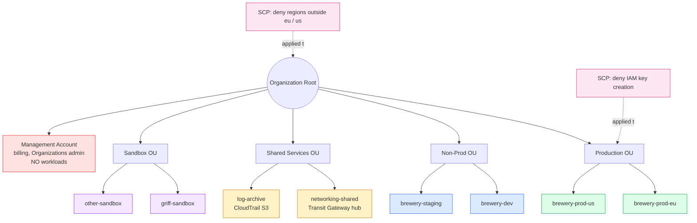

I wanted to understand why every serious AWS shop runs ten, fifty, two hundred AWS accounts instead of stuffing everything into one. The answer is *isolation* — dev mistakes don't break prod, finance can see one team's spend without seeing everyone else's, and a compromised account is a contained blast radius rather than a company-ending event. AWS Organizations is the glue that holds the multi-account estate together. The exam tests it because every real AWS customer above hobby scale uses it. Read on fellow hungovercoder.

This lesson is dataGriff's path through multi-account AWS. The canonical sources are the [AWS Organizations User Guide](https://docs.aws.amazon.com/organizations/latest/userguide/orgs_introduction.html), the [AWS Control Tower User Guide](https://docs.aws.amazon.com/controltower/latest/userguide/what-is-control-tower.html), and the [AWS Multi-Account Strategy whitepaper](https://docs.aws.amazon.com/whitepapers/latest/organizing-your-aws-environment/organizing-your-aws-environment.html) — use this lesson alongside, not instead of, those.

## Pre-Requisites

- Lessons 01–11 done
- A mental model of one AWS account = one logical isolation boundary

## The Tree of Accounts

The pieces:

- **Organization** — the container that holds all accounts. One per company.
- **Management account** (formerly "master account") — the billing root. Should hold no workloads. Used for Organizations admin and consolidated billing only.
- **Member accounts** — every other account. Where workloads run.
- **Organizational Units (OUs)** — folders to group accounts logically (Production, Non-Prod, Shared Services, Sandbox).
- **Service Control Policies (SCPs)** — guardrails that *cap* what any principal in an account can do, regardless of their IAM policies. Applied at the OU or account level.
- **Root** — the top of the tree, *not* the root user. AWS named these confusingly.

## Why Multi-Account, Not Many-Things-In-One-Account

Five reasons the exam wants you to recognise:

1. **Blast radius isolation** — a compromised dev account doesn't reach prod
2. **Resource quotas are per-account** — running everything in one account means you keep hitting service limits
3. **Easier billing breakdown** — each account is its own bill, so per-team chargeback is automatic
4. **Independent IAM blast radius** — the dev team's admin role can't touch the prod account
5. **Easier audit and compliance scoping** — auditors look at prod accounts only, not dev

The exam asks this as *"a company wants to isolate workloads, simplify billing, and limit blast radius — which AWS service should they use?"*. The answer is always **AWS Organizations + multi-account**.

## Service Control Policies — The Guardrails

An **SCP** is a policy applied to an OU or account that **caps** the permissions any principal in that account can have. It's not an IAM policy; it's a *ceiling* over IAM. Think of it like a permission boundary (lesson 04) but for the whole account.

What SCPs are good for on the exam:

- *"Prevent the dev OU from launching anything outside eu-west-2"* — `Deny ec2:*` if `aws:RequestedRegion ≠ eu-west-2`
- *"Stop anyone in any account from disabling CloudTrail or GuardDuty"* — `Deny cloudtrail:StopLogging`, `Deny guardduty:DeleteDetector`
- *"Prevent root user actions across all member accounts"* — `Deny *` with condition on `aws:PrincipalArn`

> **Exam reflex:** SCPs do **not grant** permissions. They only **restrict**. A user with no IAM policies still cannot do anything, even if an SCP "Allows" everything — SCPs only set the ceiling.

## Consolidated Billing

The least flashy but most useful Organizations feature. The management account pays one bill for the whole organization. The advantages:

- **Volume discounts** — S3, EC2, and others have tiered pricing where you pay less per unit at higher usage. Organizations pool usage across all member accounts, so the org-wide tier applies.
- **Reserved Instances and Savings Plans** — purchased in one account but applied to matching usage across the whole org. Saves you from buying RIs in every account.
- **Single bill** — one PDF, broken down by account in the Cost & Usage Report.

> Volume-discount pooling and RI/SP sharing across accounts is what the exam phrases as *"a financial benefit of using AWS Organizations"*. The answer is consolidated billing.

## Control Tower — The Set-Up-Multi-Account-Properly Button

**AWS Control Tower** sets up a multi-account *landing zone* with sensible defaults: a management account, a log archive account, an audit account, OUs, baseline SCPs, AWS SSO (Identity Center), and CloudTrail/Config across every account. It's the "I want to do multi-account properly without rolling it from scratch" button.

| Service | What it does |
|---|---|
| **AWS Organizations** | The raw multi-account container (accounts, OUs, SCPs) |
| **AWS Control Tower** | Opinionated multi-account setup *on top of* Organizations |
| **Account Factory** | Control Tower's account-provisioning workflow — request a new account via a form, it gets created with the baseline applied |
| **AWS Service Catalog** | Catalogue of approved IaC templates for end users to self-serve |

The exam phrasing: *"set up a multi-account environment with AWS best-practice guardrails automatically"* → **Control Tower**. *"Create the underlying multi-account container and apply SCPs"* → **Organizations**.

## Honest Moment

I'll be honest, the first time I set up Organizations I put all of our workloads into the management account and only later realised it's the bit AWS specifically tells you to keep empty. Migrating workloads *out* of the management account once they're running is painful — IAM resources, billing data, and CloudTrail history all stay behind. Day-one advice every AWS architect learns the hard way: **the management account is for billing and Organizations admin only. Never run a workload in it.**

The other thing nobody quite says: **SCPs feel intimidating but are mostly used as a small handful of stock guardrails** — "no IAM access key creation", "no resource creation outside our allowed Regions", "no disabling CloudTrail/Config/GuardDuty", "no deleting CloudWatch log groups before retention". Six SCPs cover 90% of what most real organisations need. You don't write hundreds of SCPs; you write the same six and apply them at the root.

## Have a Go

1. **Enable AWS Organizations** in your existing AWS account (it's free). Your account automatically becomes the management account.
2. **Create a "Sandbox" OU** and a new member account under it called `<yourname>-sandbox`. Note: the new account creation takes a few minutes and you get a fresh AWS account with its own credit card requirement skipped — billing rolls up to the management account.
3. **Attach a simple SCP** to the Sandbox OU that denies any region other than `eu-west-2`. Test it by trying to launch an EC2 instance in `us-east-1` from the sandbox account; the API call should fail with an explicit Deny.
4. **Look at the Billing console** in the management account — you should now see your one account's bill plus the new sandbox account broken out separately.

## Would I Use Control Tower for a New Org?

I would — and would only skip it if I had a specific compliance reason not to. Control Tower applies the multi-account opinions most AWS shops eventually converge on (separate log archive account, separate audit account, baseline SCPs, account factory), and skipping it means six months of rolling those up by hand. For a hobby account or a single side project, plain Organizations is fine; for anything with more than one workload, Control Tower saves real engineering time.

The bit Control Tower *doesn't* do well is custom Region restrictions — the baseline assumes US-East-1 and forces you to remove that opinion if you're an EU-only operation. Worth knowing before you turn it on.

If I were doing this lesson again I'd push the management-account-stays-empty rule higher in the lesson — it's the single most-broken multi-account rule in practice and deserves its own marquee.

## Sample exam questions

### Q1. A company has 12 AWS accounts and wants a single, consolidated bill while keeping the accounts logically separated. Which AWS service is MOST appropriate?

- A. AWS Cost Explorer
- B. AWS Organizations
- C. AWS Billing Conductor
- D. AWS Budgets

Answer

**B.** AWS Organizations provides consolidated billing — one bill for the management account, broken down per member account in the Cost & Usage Report. Cost Explorer (A) is visualisation only; Budgets (D) is for alerting on spend thresholds.

### Q2. Which AWS feature allows a company to restrict the maximum permissions available to all IAM users and roles in member accounts of an organization?

- A. IAM permission boundaries
- B. IAM policies
- C. Service Control Policies (SCPs)
- D. Resource-based policies

Answer

**C.** SCPs are Organizations-level guardrails that *cap* effective permissions across all principals in an account, regardless of their IAM policies. Permission boundaries (A) cap a single user or role; SCPs cap the entire account.

### Q3. A company wants to set up a multi-account environment with AWS best-practice guardrails, a centralised log archive account, an audit account, and Single Sign-On automatically configured. Which AWS service is MOST appropriate?

- A. AWS IAM Identity Center alone
- B. AWS Organizations alone
- C. AWS Control Tower
- D. AWS Service Catalog

Answer

**C.** Control Tower provisions an opinionated multi-account landing zone — management/log archive/audit accounts, OUs, baseline SCPs, Identity Center, CloudTrail/Config — automatically. Organizations alone (B) is just the raw container without the opinionated setup.

### Q4. A team wants to prevent any user or role in the development OU from launching resources in AWS Regions outside `eu-west-2`. Which approach is MOST appropriate?

- A. Attach an IAM policy with a region condition to every user
- B. Apply a Service Control Policy with a region condition to the development OU
- C. Manually disable other Regions in each member account
- D. Use AWS Config to detect and remediate after the fact

Answer

**B.** SCPs applied at the OU level enforce the constraint across every account in the OU and every principal in those accounts — the cleanest, organisation-wide guardrail. Per-user IAM policies (A) would need to be applied individually and could be bypassed by roles.

### Q5. Which of the following is TRUE about the management account in an AWS Organization?

- A. It must run a copy of every workload in the organization
- B. It is responsible for paying the consolidated bill and should not run workloads
- C. It must hold the only IAM Identity Center configuration
- D. It cannot have member accounts attached to it

Answer

**B.** The management account pays the consolidated bill for the whole organization and is AWS-recommended to be kept clean of workloads — running workloads there mixes the billing/governance role with the workload role and makes it hard to enforce SCPs on the management account itself.

## Sources and further reading

- [AWS Organizations User Guide](https://docs.aws.amazon.com/organizations/latest/userguide/orgs_introduction.html) — canonical multi-account container reference (accounts, OUs, SCPs)
- [Service Control Policies (SCPs)](https://docs.aws.amazon.com/organizations/latest/userguide/orgs_manage_policies_scps.html) — official guide to authoring and applying SCPs
- [AWS Control Tower User Guide](https://docs.aws.amazon.com/controltower/latest/userguide/what-is-control-tower.html) — opinionated landing-zone setup
- [Organizing Your AWS Environment Using Multiple Accounts](https://docs.aws.amazon.com/whitepapers/latest/organizing-your-aws-environment/organizing-your-aws-environment.html) — AWS whitepaper on multi-account strategy (the "good defaults" document every architect should read)
- [AWS Service Catalog](https://docs.aws.amazon.com/servicecatalog/latest/adminguide/introduction.html) — IaC product catalogue for end-user self-service
- See **[Lesson 15 — References and Further Reading](https://hungovercoders.com/training/aws-fundamentals/15-references-and-further-reading)** for the consolidated series-wide reference page

---

Well done on your Organizations lesson, fellow hungovercoder. You now know why every grown-up AWS shop has fifty accounts instead of one. On to lesson 13 where we cover pricing models, billing tools, and the budget alerts that stop a $5 sandbox bill becoming a $5,000 surprise. Bring the beer.
