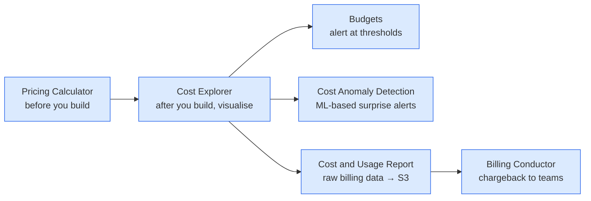

I wanted to stop being scared of the AWS bill. Cloud spend creeps — an idle NAT gateway, a dev EC2 nobody terminated, an oversized RDS pre-warmed for traffic that didn't come — and the only defence is *visibility*. AWS has six distinct cost tools and CLF-C02 tests whether you can pick the right one for a question like *"alert me before this team hits 80% of their monthly budget"* or *"detect a sudden anomalous spend"*. This lesson covers the tools, the pricing models, and ends with a hands-on £5 budget alert. Read on fellow hungovercoder.

This lesson is dataGriff's path through AWS pricing and cost management. The canonical sources are the [AWS Pricing landing page](https://aws.amazon.com/pricing/), the [AWS Billing and Cost Management User Guide](https://docs.aws.amazon.com/awsaccountbilling/latest/aboutv2/billing-what-is.html), and the [AWS Savings Plans User Guide](https://docs.aws.amazon.com/savingsplans/latest/userguide/what-is-savings-plans.html) — use this lesson alongside, not instead of, those.

## Pre-Requisites

- Lessons 01–12 done
- A management or sandbox account where you can create a budget — billing data takes ~24 hours to flow through, but the budget itself creates instantly

## Pricing Models — One Slide of Recap

Same five EC2 models from lesson 06, plus Savings Plans drawn out properly because the exam tests their variants:

| Model | Discount | Commitment | When the exam wants it |
|---|---|---|---|
| **On-Demand** | 0% | None | Short-term, unpredictable |
| **Spot** | Up to 90% | None (interruption risk) | Fault-tolerant, batch |
| **Reserved Instances** | Up to 72% | 1 or 3 years, specific instance type | Steady-state, predictable for years |
| **Compute Savings Plans** | Up to 66% | 1 or 3 years, $/hour spend across EC2, Fargate, Lambda | "Flexibility across compute services" |
| **EC2 Instance Savings Plans** | Up to 72% | 1 or 3 years, $/hour on a specific instance family in one Region | "Highest savings, commit to instance family" |
| **SageMaker Savings Plans** | Up to 64% | 1 or 3 years, $/hour on SageMaker | "Predictable SageMaker training/hosting spend" |
| **Dedicated Hosts** | n/a | None or reserved | BYOL, single-tenant compliance |

The Savings Plan vs Reserved Instance comparison the exam tests:

| | Reserved Instance | Compute Savings Plan |
|---|---|---|
| Discount applies to | A specific instance type | Any EC2, Fargate, Lambda spend |
| Flexibility | Low | High |
| Best discount | Slightly higher | Slightly lower |
| Question phrase | "Steady-state workload, same instance type" | "Flexible across instance families and compute services" |

> The exam reflex: **"flexibility across compute services"** = Compute Savings Plan. **"specific instance type for three years"** = Reserved Instance. **"interruptible workload"** = Spot. **"single-tenant hardware"** = Dedicated Hosts.

## The Six Cost Tools



| Tool | What it does | Trigger phrase |
|---|---|---|
| **AWS Pricing Calculator** | Estimate cost of a workload *before* building it | "Estimate cost before deployment" |
| **AWS Cost Explorer** | Visualise spend, forecast future spend, group by service/tag/account | "Visualise / analyse current and past spend" |
| **AWS Budgets** | Set monthly/yearly thresholds and alert on actual or forecast | "Alert when spend exceeds $X" |
| **AWS Cost Anomaly Detection** | ML model that surfaces unusual spikes without manual thresholds | "Detect unexpected anomalies in spend" |
| **AWS Cost and Usage Report (CUR)** | Hourly granularity billing data exported to S3, query with Athena | "Detailed line-item billing for analysis" |
| **AWS Billing Conductor** | Custom billing constructs for internal chargeback | "Charge internal teams for their AWS usage" |

> The most-asked distinction: **Cost Explorer is visualisation, Budgets is alerting, Anomaly Detection is ML-spike-detection.** Three different tools, three different jobs, often on the same exam.

## Tagging for Cost Allocation

The most important production habit on AWS. Tagging is **how you attribute spend back to teams, environments, customers, products**. The pattern:

- Every resource gets at least three tags: `Environment` (`prod`/`dev`/`test`), `Team` (or `Owner`), `CostCentre` (or `Project`).
- In the **Billing console → Cost allocation tags**, activate those tags. They start appearing in Cost Explorer and the CUR as filterable dimensions.
- Tags can be enforced via SCPs ("deny resource creation without a `CostCentre` tag") in Organizations — see lesson 12.

The exam reflex: *"how does a company attribute costs to specific business units?"* → **Cost Allocation Tags**.

## AWS Free Tier — What's Actually Free

CLF-C02 will absolutely ask whether you know the three categories of Free Tier:

| Category | What it means | Examples |
|---|---|---|
| **Always Free** | Free forever, within limits | 1M Lambda invocations/month, 25 GB DynamoDB, 1M SNS publishes |
| **12-month Free** | Free for the first 12 months from account creation | 750 hrs/month `t2.micro` or `t3.micro` EC2, 5 GB S3 Standard, 750 hrs RDS db.t3.micro |
| **Trials** | Short-term free trial of a paid service | 30-day free Inspector, 30-day free GuardDuty |

The exam phrases this as *"a startup wants to evaluate AWS for the first year at minimal cost — which service is free?"* — and the answer is whichever option uses Always-Free or 12-month-Free limits.

## Hands-On — Setting a £5 Budget Alert

This is the AGENTS-mandated hands-on bit. The point is to have AWS email you long *before* the bill becomes a surprise. The two JSON files in this lesson folder define the budget itself (`budget.json`) and the notification list (`notification.json` — swap the email address before running).

Edit `notification.json` and change `you@example.com` to your real email. Then create the budget:

```bash
# Get your account ID
ACCOUNT_ID=$(aws sts get-caller-identity --query Account --output text --profile brewery-admin)

aws budgets create-budget \
  --account-id "$ACCOUNT_ID" \
  --budget file://budget.json \
  --notifications-with-subscribers file://notification.json \
  --profile brewery-admin

# Confirm it's there
aws budgets describe-budgets --account-id "$ACCOUNT_ID" --profile brewery-admin
```

What this gives you:

- A £5 monthly cost budget covering everything in the account
- Email at 80% of *actual* spend (£4 already used this month)
- Email at 100% of *forecast* spend (Cost Explorer predicts you'll exceed £5)

Tear-down:

```bash
aws budgets delete-budget \
  --account-id "$ACCOUNT_ID" \
  --budget-name brewery-sandbox-monthly-5gbp \
  --profile brewery-admin
```

I'll be honest — every single AWS account I run has a £5 budget alert configured before any resources are created. The cost of forgetting an idle resource for a month adds up faster than you'd think, and the email arrives long before the credit card statement does. Set it once at account creation; you'll never regret it.

## Have a Go

1. **Create the £5 budget** using the JSON above. Verify the email confirmation arrives (AWS sends a confirmation when you subscribe an email to budget notifications).
2. **Open Cost Explorer** (Billing → Cost Explorer) and look at your account's spend so far. Even a development account shows a few line items.
3. **Activate two cost allocation tags** (`Environment`, `Team`) in Billing → Cost allocation tags. Even if you haven't tagged any resources yet, this enables the dimension for the future.
4. **Open AWS Pricing Calculator** (<https://calculator.aws>) and estimate the cost of running a `t3.medium` 24/7 in `eu-west-2` for a year, plus an Aurora `db.t3.medium`, plus 100 GB S3 Standard. Compare against 3-year All-Upfront Reserved for the EC2 — the savings should make the case.

## Would I Set Up Cost Management Differently in Production?

For a serious organisation: **Cost and Usage Report exported daily to a dedicated S3 bucket in a billing-only account, queried via Athena**, dashboards in QuickSight, **AWS Cost Anomaly Detection** turned on for every service, and a **chargeback model in Billing Conductor** so each team sees their own slice. Plus a **mandatory tagging policy enforced via SCPs** so every resource gets `Environment`, `Team`, `CostCentre`, `Project` at creation.

For a personal account or small project: the £5 budget alert above + Cost Anomaly Detection (free for the first three months) + a quick weekly look at Cost Explorer is enough. Don't over-engineer cost management until the spend justifies it.

If I were doing this lesson again I'd put the £5 budget at the top, not the bottom. It's the single most-important habit and people skip it because they're paying attention to pricing models instead. Pricing models are the exam content; the £5 budget is the survival content.

## Sample exam questions

### Q1. A finance team wants to receive an email alert when monthly AWS spend exceeds 80% of a defined threshold. Which AWS service is MOST appropriate?

- A. AWS Cost Explorer
- B. AWS Budgets
- C. AWS Cost Anomaly Detection
- D. AWS Cost and Usage Report

<details>
<summary>Answer</summary>

**B.** Budgets is the AWS service for threshold-based alerts on spend. Cost Explorer (A) is for visualisation; Anomaly Detection (C) catches unusual spikes via ML without manual thresholds; the CUR (D) is raw billing data, not an alerting tool.
</details>

### Q2. A workload requires steady-state EC2 capacity for the next 3 years on a fixed instance family. The company wants the LOWEST possible compute cost. Which option is MOST appropriate?

- A. On-Demand Instances
- B. Spot Instances
- C. 3-year All-Upfront EC2 Instance Savings Plan
- D. Dedicated Hosts

<details>
<summary>Answer</summary>

**C.** EC2 Instance Savings Plans give the deepest discount (up to 72%) when committing to a specific instance family for 3 years All-Upfront. Spot (B) is cheaper per hour but unsuitable for steady-state because instances can be reclaimed.
</details>

### Q3. A team wants to be alerted to unusual or unexpected cost spikes without configuring specific budget thresholds. Which AWS service uses machine learning to surface anomalies?

- A. AWS Cost Explorer
- B. AWS Budgets
- C. AWS Cost Anomaly Detection
- D. AWS Trusted Advisor

<details>
<summary>Answer</summary>

**C.** Cost Anomaly Detection uses ML to surface unusual spikes — no manual thresholds. The trigger phrase "without configuring thresholds" or "anomaly" almost always points here.
</details>

### Q4. A company wants to attribute AWS costs to specific business teams, environments, and projects. Which AWS feature is MOST appropriate?

- A. AWS Cost Allocation Tags
- B. AWS Service Control Policies
- C. AWS Cost and Usage Report alone
- D. AWS Pricing Calculator

<details>
<summary>Answer</summary>

**A.** Cost allocation tags (combined with the Billing console activating them) are the AWS-native way to attribute spend by tag dimension. The CUR (C) is the underlying data, but the *attribution* mechanism is tagging.
</details>

### Q5. A company wants to estimate the cost of a new workload BEFORE provisioning any resources. Which AWS service is MOST appropriate?

- A. AWS Cost Explorer
- B. AWS Pricing Calculator
- C. AWS Budgets
- D. AWS Cost and Usage Report

<details>
<summary>Answer</summary>

**B.** Pricing Calculator estimates *future* costs from a configurable list of services and quantities. The other three tools work on *actual* historical spend, not estimates.
</details>

## Sources and further reading

- [AWS Pricing landing page](https://aws.amazon.com/pricing/) — top-level entry to per-service pricing pages
- [AWS Pricing Calculator](https://calculator.aws/) — pre-deployment cost estimation
- [AWS Cost Explorer](https://docs.aws.amazon.com/cost-management/latest/userguide/ce-what-is.html) — historical spend visualisation and forecasting
- [AWS Budgets](https://docs.aws.amazon.com/cost-management/latest/userguide/budgets-managing-costs.html) — threshold-based cost / usage / savings plans alerts
- [AWS Cost Anomaly Detection](https://docs.aws.amazon.com/cost-management/latest/userguide/manage-ad.html) — ML-based spike detection
- [AWS Cost and Usage Report](https://docs.aws.amazon.com/cur/latest/userguide/what-is-cur.html) — hourly-granularity billing exports to S3
- [AWS Savings Plans User Guide](https://docs.aws.amazon.com/savingsplans/latest/userguide/what-is-savings-plans.html) — the three Savings Plan variants and how they apply
- [AWS Free Tier](https://aws.amazon.com/free/) — Always-Free, 12-month-Free, and trial allowances
- [Cost Allocation Tags](https://docs.aws.amazon.com/awsaccountbilling/latest/aboutv2/cost-alloc-tags.html) — activating tags for chargeback and reporting
- `SOURCES.md` at the repo root for the series-wide reference list

---

Well done on your cost-management lesson, fellow hungovercoder. Budget alert in place, cost tools mapped, pricing models drilled. On to the final lesson — AWS Support plans, exam day, and what's after CLF-C02. Bring the beer.
